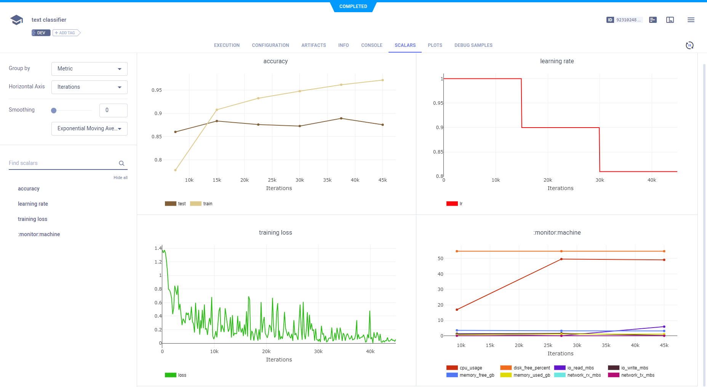
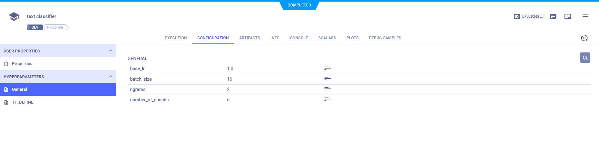
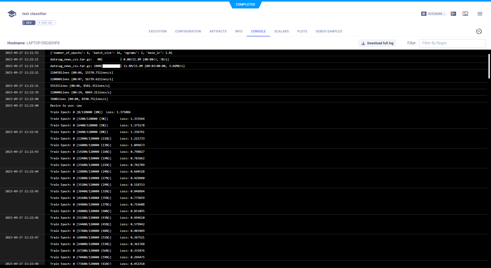

The example [text_classification_AG_NEWS.ipynb](https://github.com/allegroai/clearml/blob/master/examples/frameworks/pytorch/notebooks/text/text_classification_AG_NEWS.ipynb) 
demonstrates using Jupyter Notebook for ClearML, and the integration of ClearML into code which trains a network 
to classify text in the `torchtext` [AG_NEWS](https://pytorch.org/text/stable/datasets.html#ag-news) dataset, and then applies the model to predict the classification of sample text. ClearML automatically logs the scalar and console output by calling TensorBoard methods. In the example, we explicitly log parameters with the Task. When the script runs, it creates an experiment named `text classifier` which is associated with the `Text Example` project.

## Scalars

Accuracy, learning rate, and training loss appear in **SCALARS**, along with the resource utilization plots, which are titled **:monitor: machine**.



## Hyperparameters

ClearML automatically logs the command line options, because the example code uses `argparse`. A parameter dictionary 
is logged by connecting it to the Task using a call to the [Task.connect](../../../../../references/sdk/task.md#connect) 
method.

```python
configuration_dict = {
    'number_of_epochs': 6, 'batch_size': 16, 'ngrams': 2, 'base_lr': 1.0
}
# enabling configuration override by clearml
configuration_dict = task.connect(configuration_dict)  
```
    
Command line options appear in **CONFIGURATION** **>** **HYPERPARAMETERS** **>** **Args**.



Parameter dictionaries appear in the **General** subsection.


## Console

Text printed to the console for training progress, as well as all other console output, appear in **CONSOLE**.



