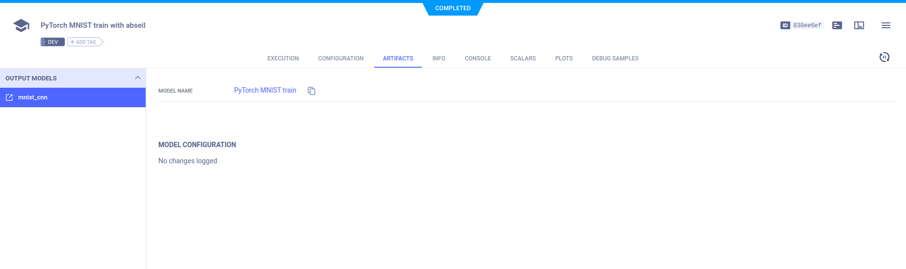

The [pytorch_abseil.py](https://github.com/allegroai/clearml/blob/master/examples/frameworks/pytorch/pytorch_abseil.py) 
example demonstrates the integration of ClearML into code that uses PyTorch and [`absl.flags`](https://abseil.io/docs/python/guides/flags). 

The example script does the following:
* Trains a simple deep neural network on the PyTorch built-in [MNIST](https://pytorch.org/vision/stable/datasets.html#mnist)
  dataset
* Creates an experiment named `pytorch mnist train with abseil`, which is associated with the `examples` project
* ClearML automatically logs the absl.flags, and the models (and their snapshots) created by PyTorch 
* Additional metrics are logged by calling the [Logger.report_scalar](../../../references/sdk/logger.md#report_scalar) 
  method
  
## Scalars

In the example script's `train` function, the following code explicitly reports scalars to ClearML:

```python
Logger.current_logger().report_scalar(
    "train", 
    "loss", 
    iteration=(epoch * len(train_loader) + batch_idx), 
    value=loss.item()
)
```

In the `test` method, the code explicitly reports `loss` and `accuracy` scalars.

```python
Logger.current_logger().report_scalar(
    "test", "loss", iteration=epoch, value=test_loss
)
Logger.current_logger().report_scalar(
    "test", 
    "accuracy", 
    iteration=epoch, 
    value=(correct / len(test_loader.dataset))
)
```    

These scalars can be visualized in plots, which appear in the [ClearML web UI](../../../webapp/webapp_overview.md), in 
the experiment's **SCALARS** tab. 


## Hyperparameters

ClearML automatically logs command line options defined with abseil flags. They appear in **CONFIGURATION** **>** 
**HYPERPARAMETERS** **>** **TF_DEFINE**.


## Console

Text printed to the console for training progress, as well as all other console output, appear in **CONSOLE**.


## Artifacts

Models created by the experiment appear in the experiment's **ARTIFACTS** tab. ClearML automatically logs and tracks 
models and any snapshots created using PyTorch.  



Clicking on the model name takes you to the [model's page](../../../webapp/webapp_model_viewing.md), where you can view 
the model's details and access the model.

