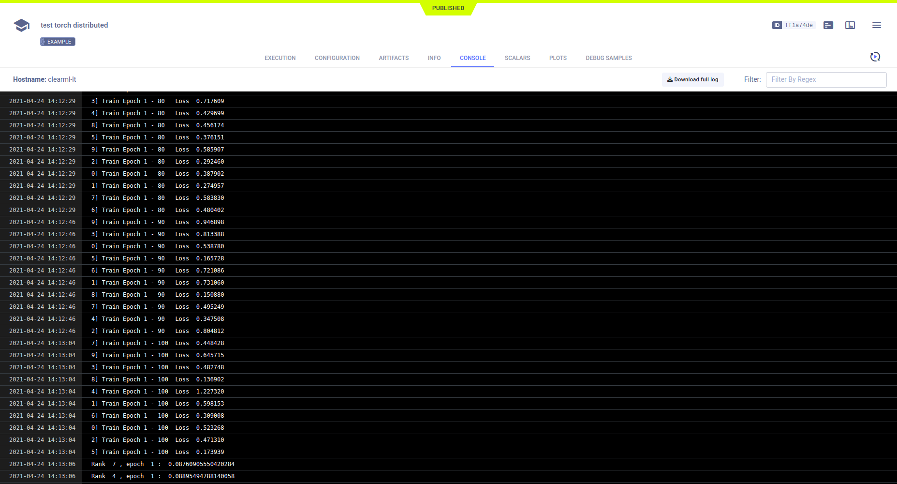

The [pytorch_distributed_example.py](https://github.com/allegroai/clearml/blob/master/examples/frameworks/pytorch/pytorch_distributed_example.py) 
script demonstrates integrating ClearML into a code that uses the [PyTorch Distributed Communications Package](https://pytorch.org/docs/stable/distributed.html) 
(`torch.distributed`). 

The script does the following: 
1. It initializes a main Task and spawns subprocesses, each for an instance of that Task. 
   
1. The Task in each subprocess trains a neural network over a partitioned dataset (the torchvision built-in [MNIST](https://pytorch.org/vision/stable/datasets.html#mnist) 
   dataset), and reports the following to the main Task:
    * Artifacts - A dictionary containing different key-value pairs is uploaded from the Task in each subprocess to the main Task.
    * Scalars - Loss reported as a scalar during training in each subprocess Task is logged in the main Task.
    * Hyperparameters - Hyperparameters created in each subprocess Task are added to the main Task's hyperparameters.  
      
    
  Each Task in a subprocess references the main Task by calling [Task.current_task](../../../references/sdk/task.md#taskcurrent_task), 
    which always returns the main Task.

1. When the script runs, it creates an experiment named `test torch distributed` which is associated with the `examples` project in the **ClearML Web UI**.

### Artifacts

The example uploads a dictionary as an artifact in the main Task by calling the [Task.upload_artifact](../../../references/sdk/task.md#upload_artifact)
method on `Task.current_task` (the main Task). The dictionary contains the `dist.rank` of the subprocess, making each unique.

    Task.current_task().upload_artifact(
        'temp {:02d}'.format(dist.get_rank()), artifact_object={'worker_rank': dist.get_rank()})

All of these artifacts appear in the main Task, **ARTIFACTS** **>** **OTHER**.


## Scalars

Report loss to the main Task by calling the [Logger.report_scalar](../../../references/sdk/logger.md#report_scalar) method 
on `Task.current_task().get_logger`, which is the logger for the main Task. Since `Logger.report_scalar` is called with the 
same title (`loss`), but a different series name (containing the subprocess' `rank`), all loss scalar series are logged together.

    Task.current_task().get_logger().report_scalar(
        'loss', 'worker {:02d}'.format(dist.get_rank()), value=loss.item(), iteration=i)

The single scalar plot for loss appears in **SCALARS**.


## Hyperparameters

ClearML automatically logs the command line options defined using `argparse`. 

A parameter dictionary is logged by connecting it to the Task using a call to the [`Task.connect`](../../../references/sdk/task.md#connect) 
method.

```python
param = {'worker_{}_stuff'.format(dist.get_rank()): 'some stuff ' + str(randint(0, 100))}
Task.current_task().connect(param)
```

Command line options appear in **CONFIGURATION** **>** **HYPER PARAMETERS** **>** **Args**.


Parameter dictionaries appear in the **General** section of **HYPER PARAMETERS**.

```python
param = {'worker_{}_stuff'.format(dist.get_rank()): 'some stuff ' + str(randint(0, 100))}
Task.current_task().connect(param)
```


## Log

Output to the console, including the text messages printed from the main Task object and each subprocess, appears in **CONSOLE**.

