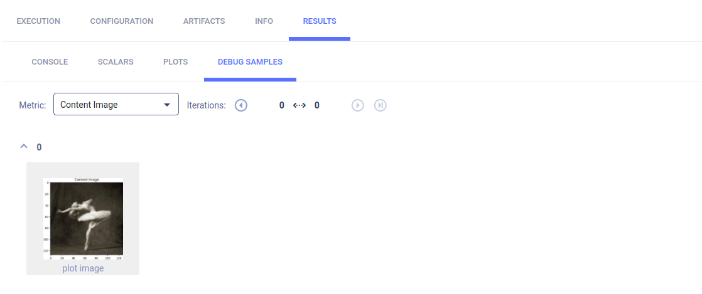
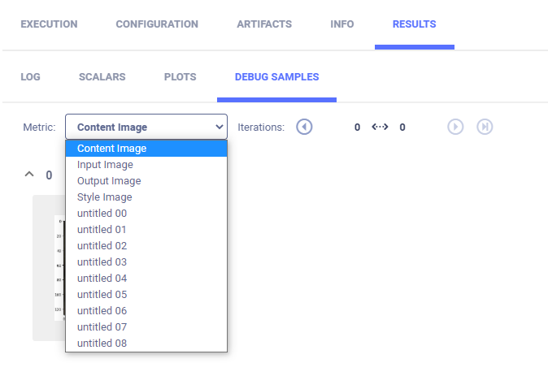
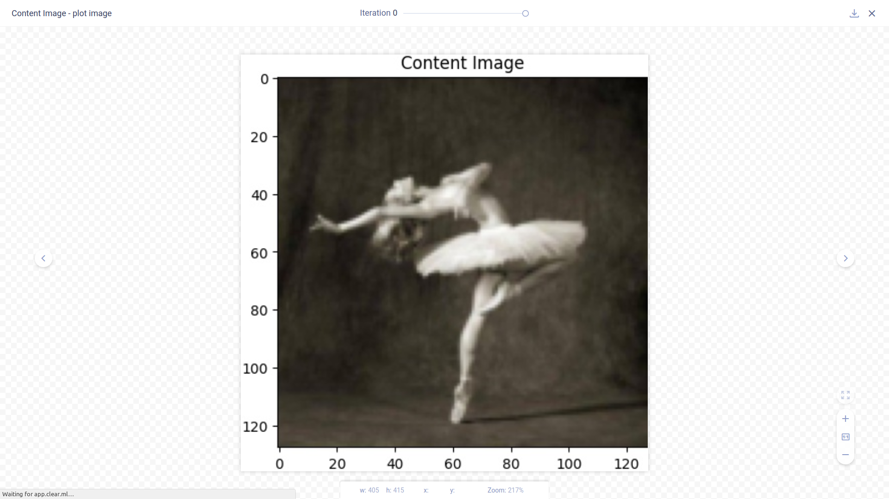

The [pytorch_matplotlib.py](https://github.com/allegroai/clearml/blob/master/examples/frameworks/pytorch/pytorch_matplotlib.py) 
example demonstrates the integration of ClearML into code that uses PyTorch and Matplotlib. 

The example does the following: 
* Creates an experiment named `pytorch with matplotlib example`, in the `examples` project.
* The script calls Matplotlib methods to show images, each with a different title.
* ClearML automatically logs the images as debug samples. 

## Debug Samples

The images shown in the example script's `imshow` function appear according to metric in **DEBUG SAMPLES**.

Select a debug sample by metric.

Open the debug sample in the image viewer.

