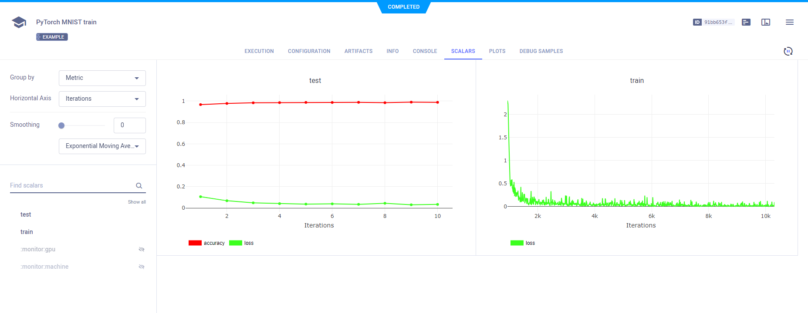
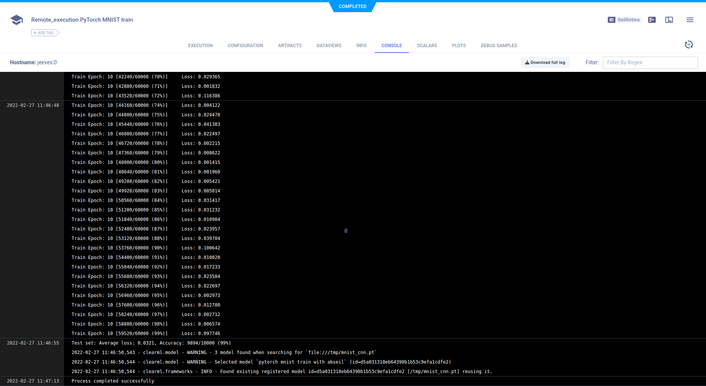
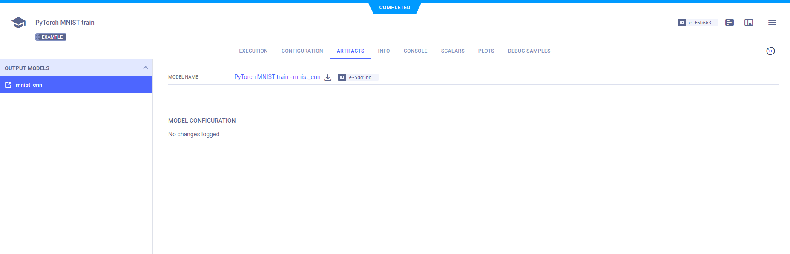
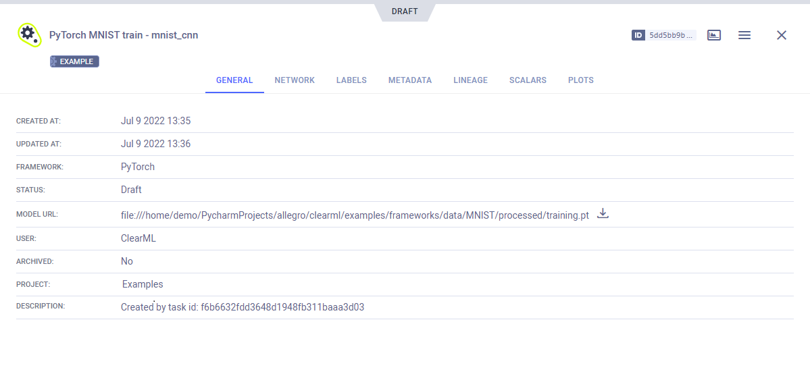

The [pytorch_mnist.py](https://github.com/allegroai/clearml/blob/master/examples/frameworks/pytorch/pytorch_mnist.py) example 
demonstrates the integration of **ClearML** into code that uses PyTorch. 

The example script does the following:
* Trains a simple deep neural network on the PyTorch built-in [MNIST](https://pytorch.org/vision/stable/datasets.html#mnist)
  dataset.
* Uses **ClearML** automatic logging. 
* Calls the [Logger.report_scalar](../../../references/sdk/logger.md#report_scalar) method to demonstrate explicit reporting, 
  which allows adding customized reporting to the code.
* Creates an experiment named `pytorch mnist train`, which is associated with the `examples` project.

## Scalars

In the example script's `train` function, the following code explicitly reports scalars to **ClearML**:

```python
Logger.current_logger().report_scalar(
    "train", "loss", iteration=(epoch * len(train_loader) + batch_idx), value=loss.item())
```

In the `test` method, the code explicitly reports `loss` and `accuracy` scalars.

```python
Logger.current_logger().report_scalar(
    "test", "loss", iteration=epoch, value=test_loss)
Logger.current_logger().report_scalar(
    "test", "accuracy", iteration=epoch, value=(correct / len(test_loader.dataset)))
```    

These scalars can be visualized in plots, which appear in the **ClearML web UI**, in the experiment's
page **>** **RESULTS** **>** **SCALARS**. 


## Hyperparameters

**ClearML** automatically logs command line options defined with `argparse`. They appear in **CONFIGURATIONS** **>** **HYPER PARAMETERS** **>** **Args**.


## Console

Text printed to the console for training progress, as well as all other console output, appear in **RESULTS** **>** **CONSOLE**.



## Artifacts

Model artifacts associated with the experiment appear in the info panel of the **EXPERIMENTS** tab and in 
the info panel of the **MODELS** tab.  


The experiment info panel shows model tracking, including the model name and design (in this case, no design was stored).



The model info panel contains the model details, including: 
* Model URL
* Framework
* Snapshot locations.

