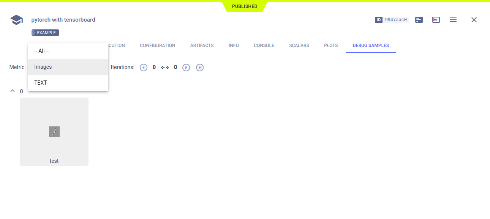
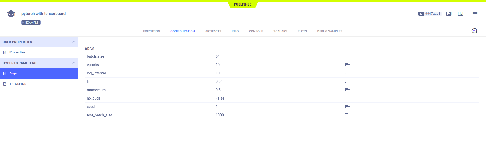

The [pytorch_tensorboard.py](https://github.com/allegroai/clearml/blob/master/examples/frameworks/pytorch/pytorch_tensorboard.py) 
example demonstrates the integration of ClearML into code that uses PyTorch and TensorBoard. 

The example does the following:
* Trains a simple deep neural network on the PyTorch built-in [MNIST](https://pytorch.org/vision/stable/datasets.html#mnist) 
  dataset.
* Creates an experiment named `pytorch with tensorboard`, which is associated with the `examples` project.
* ClearML automatically captures scalars and text logged using the TensorBoard `SummaryWriter` object, and 
  the model created by PyTorch. 

## Scalars

In the example script, the `train` and `test` functions call the TensorBoard `SummaryWriter.add_scalar` method to log loss. 
These scalars, along with the resource utilization plots, which are titled **:monitor: machine**, appear in the experiment's 
page in the [ClearML web UI](../../../webapp/webapp_overview.md) under **SCALARS**. 

## Debug Samples

ClearML automatically tracks images and text output to TensorFlow. They appear in **DEBUG SAMPLES**.

## Hyperparameters

ClearML automatically logs TensorFlow Definitions. They appear in **CONFIGURATION** **>** **HYPERPARAMETERS** **>** **TF_DEFINE**.

## Console

Text printed to the console for training progress, as well as all other console output, appear in **CONSOLE**.

## Artifacts

Models created by the experiment appear in the experiment’s **ARTIFACTS** tab. ClearML automatically logs and tracks 
models and any snapshots created using PyTorch. 

Clicking on a model's name takes you to the [model’s page](../../../webapp/webapp_model_viewing.md), where you can view 
the model’s details and access the model.

