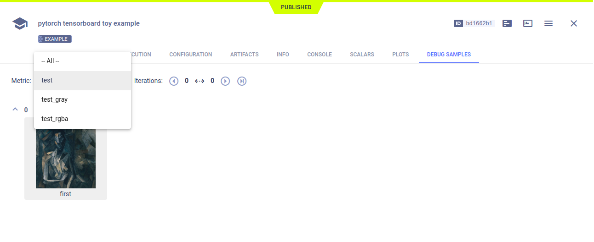
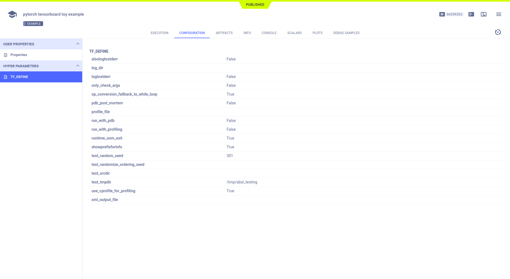

The [tensorboard_toy_pytorch.py](https://github.com/allegroai/clearml/blob/master/examples/frameworks/pytorch/tensorboard_toy_pytorch.py) 
example demonstrates the integration of ClearML into code, which creates a TensorBoard `SummaryWriter` object to log 
debug sample images. When the script runs, it creates an experiment named `pytorch tensorboard toy example`, which is 
associated with the `examples` project.

## Debug Samples

The debug sample images appear according to metric, in the experiment's **DEBUG SAMPLES** tab.

## Hyperparameters

ClearML automatically logs TensorFlow Definitions. They appear in **CONFIGURATION** **>** **HYPERPARAMETERS** **>** **TF_DEFINE**.

