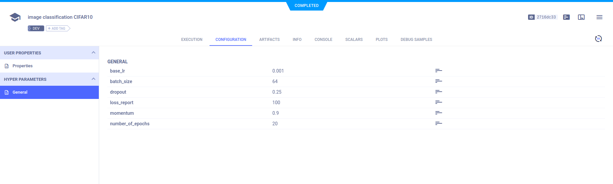
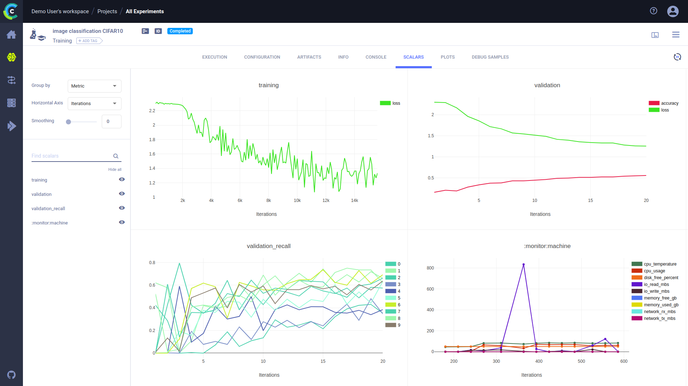
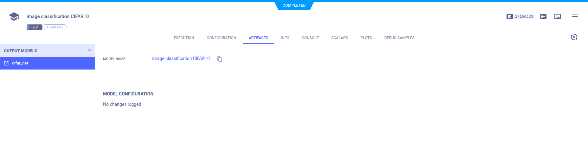
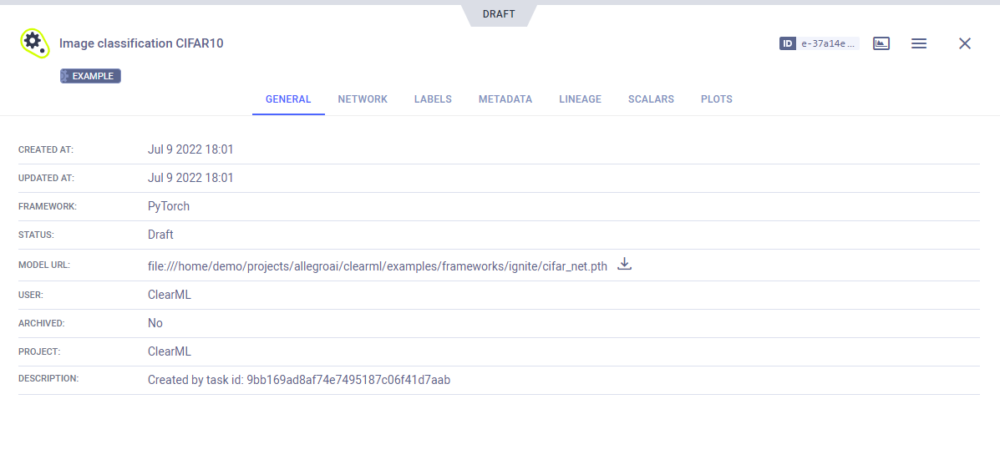
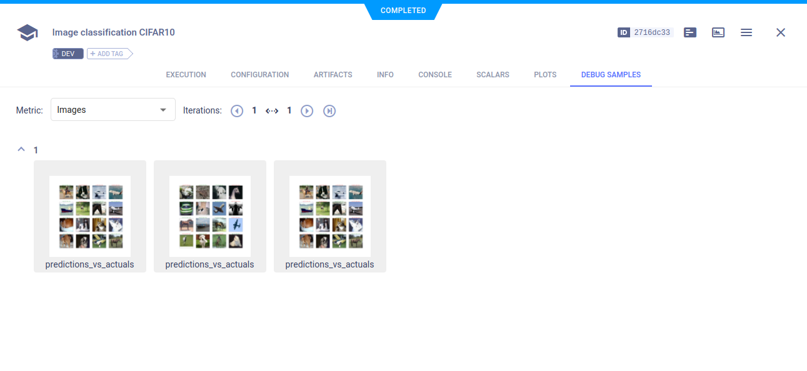

The [cifar_ignite.py](https://github.com/allegroai/clearml/blob/master/examples/frameworks/ignite/cifar_ignite.py) example 
script integrates ClearML into code that uses [PyTorch Ignite](https://github.com/pytorch/ignite). 

The example script does the following:
* Trains a neural network on the CIFAR10 dataset for image classification.
* Creates a [ClearML Task](../../../fundamentals/task.md) named `image classification CIFAR10`, which is associated with 
  the `examples` project.
* Calls the [`Task.connect`](../../../references/sdk/task.md#connect) method to track experiment configuration.
* Uses `ignite`'s `TensorboardLogger` and attaches handlers to it. See [`TensorboardLogger`](https://github.com/pytorch/ignite/blob/master/ignite/contrib/handlers/tensorboard_logger.py). 

ClearML's automatic logging captures information and outputs logged with `TensorboardLogger`.

## Hyperparameters

Parameters are explicitly reported to ClearML using the [`Task.connect`](../../../references/sdk/task.md#connect) method.  

```python
params = {'number_of_epochs': 20, 'batch_size': 64, 'dropout': 0.25, 'base_lr': 0.001, 'momentum': 0.9, 'loss_report': 100}
params = task.connect(params)  # enabling configuration override by clearml
```
The hyperparameter configurations can be viewed in the WebApp in the experiment's **CONFIGURATION** tab. 



## Ignite TensorboardLogger

`TensorboardLogger` is a handler to log metrics, parameters, and gradients when training a model. When ClearML is integrated
into a script which uses `TensorboardLogger`, all information logged through the handler is automatically captured by ClearML. 
   
## Scalars 

ClearML automatically captures scalars logged through `TensorboardLogger`. 

View the scalars in the experiment's page in the **ClearML Web UI**, in **SCALARS**.




## Model Snapshots

ClearML automatically captures the model logged with Torch, and saves it as an artifact. 

View saved snapshots in the experiment's **ARTIFACTS** tab.



To view the model, in the **ARTIFACTS** tab, click the model name (or download it).




## Debug Samples

ClearML automatically tracks images logged to TensorboardLogger. They appear in **DEBUG SAMPLES**.




## Ignite ClearMLLogger

PyTorch Ignite also supports a dedicated `ClearMLLogger` handler to log metrics, text, model / optimizer parameters, plots, and model 
checkpoints during training and validation.

For more information, see the [PyTorch Ignite ClearMLLogger](pytorch_ignite_mnist.md)
example.

