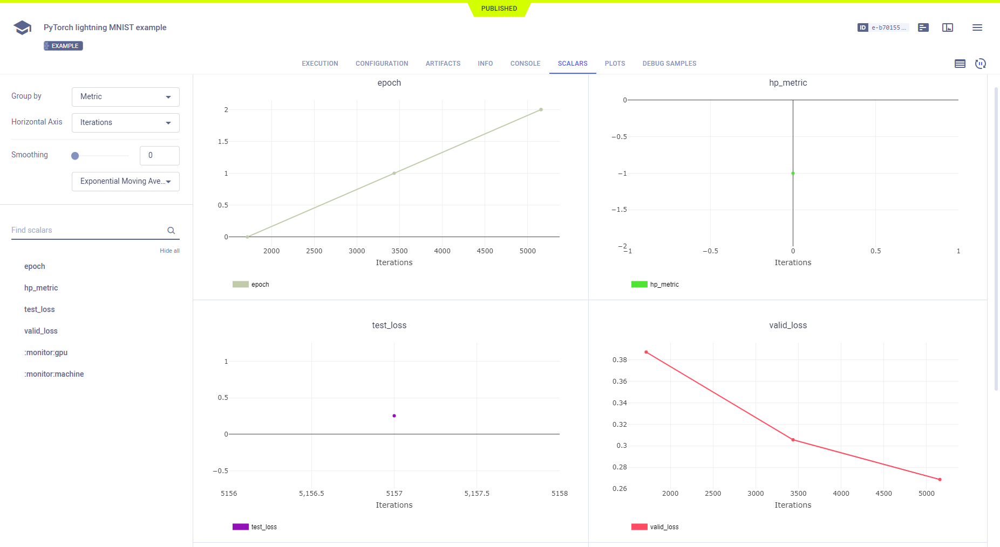
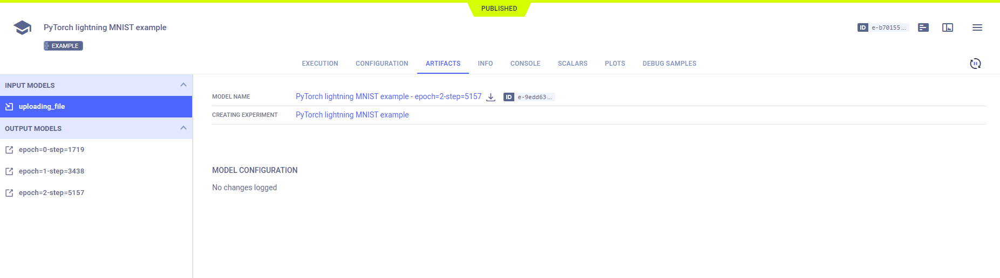
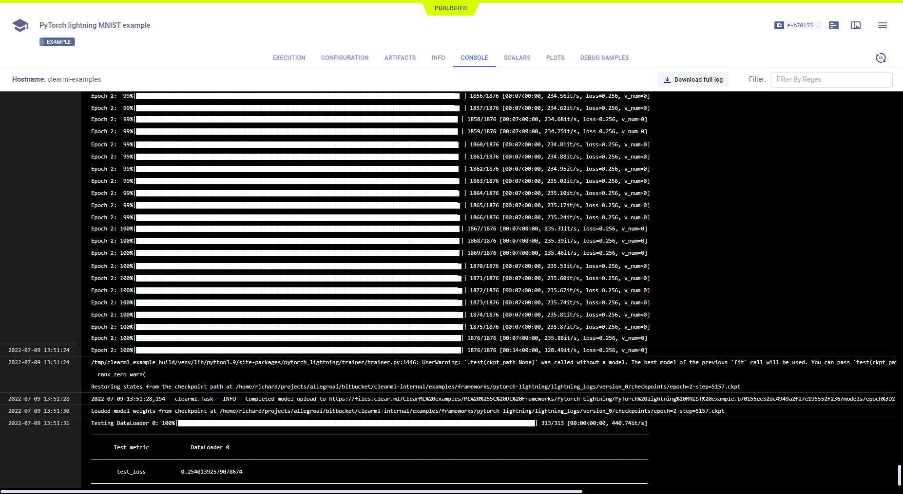

The [pytorch-lightning](https://github.com/allegroai/clearml/blob/master/examples/frameworks/pytorch-lightning/pytorch_lightning_example.py) 
script demonstrates the integration of ClearML into code that uses [PyTorch Lightning](https://www.pytorchlightning.ai/). 

The example script does the following:
* Trains a simple deep neural network on the PyTorch built-in MNIST dataset
* Defines Argparse command line options, which are automatically captured by ClearML
* Creates an experiment named `pytorch lightning mnist example`, which is associated with the `examples` project.

## Scalars

The test loss and validation loss plots appear in the experiment's page in the ClearML web UI under **SCALARS**. 
Resource utilization plots, which are titled **:monitor: machine**, also appear in the **SCALARS** tab. All of these 
plots are automatically captured by ClearML. 

## Hyperparameters

ClearML automatically logs command line options defined with argparse and TensorFlow Definitions, which appear in 
**CONFIGURATIONS > HYPERPARAMETERS > Args** and **TF_DEFINE** respectively. 

## Artifacts

Models created by the experiment appear in the experiment’s **ARTIFACTS** tab.

Clicking on a model name takes you to the [model’s page](../../../webapp/webapp_model_viewing.md), where you can view 
the model’s details and access the model.

## Console

All other console output appears in **CONSOLE**.

