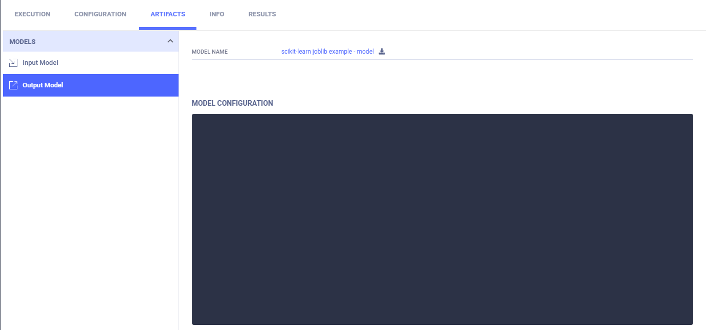
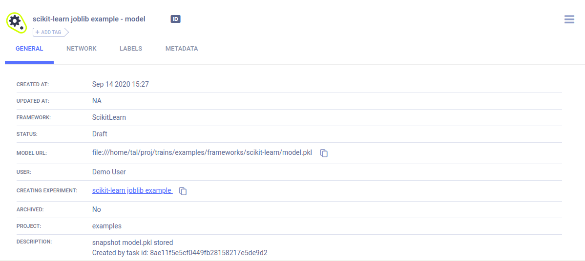

The [sklearn_joblib_example.py](https://github.com/allegroai/clearml/blob/master/examples/frameworks/scikit-learn/sklearn_joblib_example.py) 
demonstrates the integration of ClearML into code that uses `scikit-learn` and `joblib` to store a model and model snapshots, 
and `matplotlib` to create a scatter diagram. When the script runs, it creates an experiment named 
`scikit-learn joblib example`, which is associated with the `examples` project.

## Plots

ClearML automatically logs the scatter plot, which appears in the [experiment's page](../../../webapp/webapp_exp_track_visual.md) 
in the ClearML web UI, under **PLOTS**.

## Artifacts

Models created by the experiment appear in the experiment’s **ARTIFACTS** tab. 

Clicking on the model name takes you to the [model’s page](../../../webapp/webapp_model_viewing.md), where you can 
view the model’s details and access the model.

