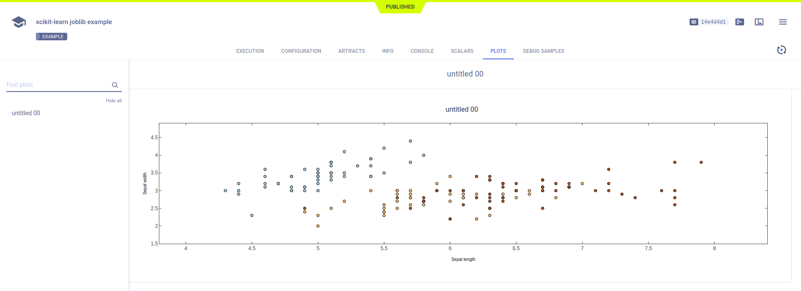
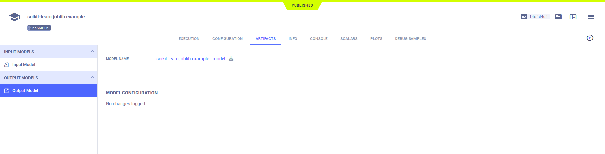

The [sklearn_joblib_example.py](https://github.com/allegroai/clearml/blob/master/examples/frameworks/scikit-learn/sklearn_joblib_example.py) 
demonstrates the integration of **ClearML** into code that uses `scikit-learn` and `joblib` to store a model and model snapshots, 
and `matplotlib` to create a scatter diagram. When the script runs, it creates an experiment named `scikit-learn joblib examplescikit-learn joblib example`, which is associated with the `examples` project.

## Plots

**ClearML** automatically logs the scatter plot, which appears in the experiment's page in the **ClearML web UI**, under  
**RESULTS** **>** **PLOTS**.

## Artifacts

Model artifacts associated with the experiment appear in the info panel of the **EXPERIMENTS** tab and in the info panel 
of the **MODELS** tab.  

The experiment info panel shows model tracking, including the model name and design (in this case, no design was stored).

The model info panel contains the model details, including: 
* Model URL 
* Framework 
* Snapshot locations.

