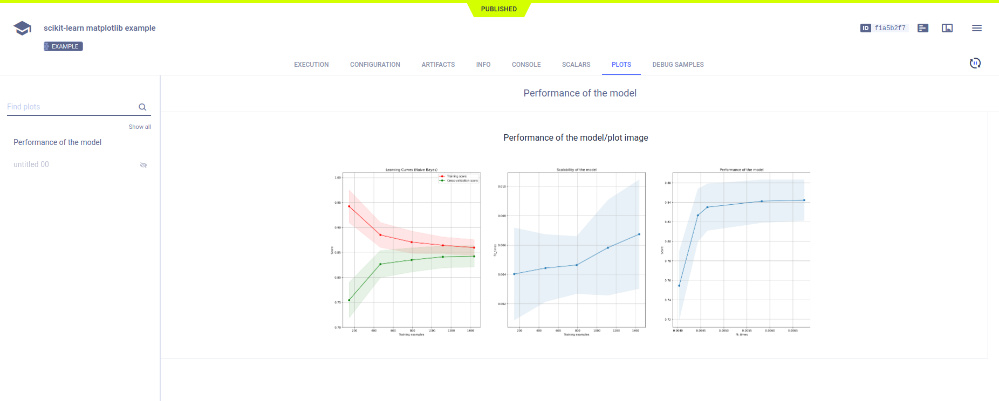

The [sklearn_matplotlib_example.py](https://github.com/allegroai/clearml/blob/master/examples/frameworks/scikit-learn/sklearn_matplotlib_example.py) 
script demonstrates the integration of ClearML into code that uses `scikit-learn` and `matplotlib`.

The example does the following: 
* Uses `scikit-learn` to determine cross-validated training and test scores.
* Uses `matplotlib` to plot the learning curves. 
* ClearML automatically logs the scatter diagrams for the learning curves.
* Creates an experiment named `scikit-learn matplotlib example` in the `examples` project.

## Plots

The learning curve plots appear in the **ClearML web UI** under **RESULTS** **>** **PLOTS**.

