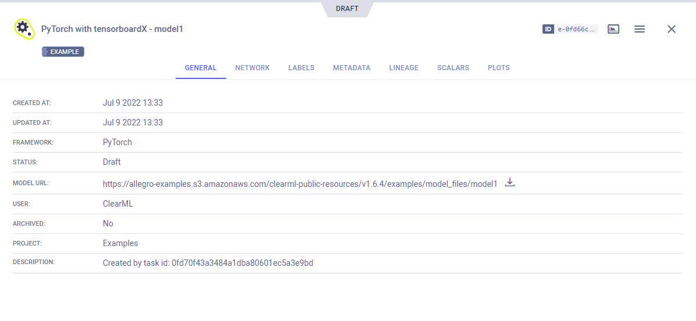

The [pytorch_tensorboardX.py](https://github.com/allegroai/clearml/blob/master/examples/frameworks/tensorboardx/pytorch_tensorboardX.py) 
example demonstrates the integration of ClearML into code that uses PyTorch and TensorBoardX. 

The script does the following:
* Trains a simple deep neural network on the PyTorch built-in [MNIST](https://pytorch.org/vision/stable/datasets.html#mnist) dataset
* Creates an experiment named `pytorch with tensorboardX` which is associated with the `examples` project
* ClearML automatically captures scalars and text logged using the TensorBoardX `SummaryWriter` object, and 
  the model created by PyTorch 

## Scalars

The loss and accuracy metric scalar plots appear in the experiment's page in the **ClearML web UI**, under
**SCALARS**. The also includes resource utilization plots, which are titled **:monitor: machine**.

## Hyperparameters

ClearML automatically logs command line options defined with `argparse`. They appear in **CONFIGURATION** **>** 
**HYPERPARAMETERS** **>** **Args**.

## Console

Text printed to the console for training progress, as well as all other console output, appear in **CONSOLE**.

## Artifacts

Models created by the experiment appear in the experiment’s **ARTIFACTS** tab. ClearML automatically logs and tracks 
models and any snapshots created using PyTorch. 

Clicking on the model’s name takes you to the [model’s page](../../../webapp/webapp_model_viewing.md), where you can 
view the model’s details and access the model.

