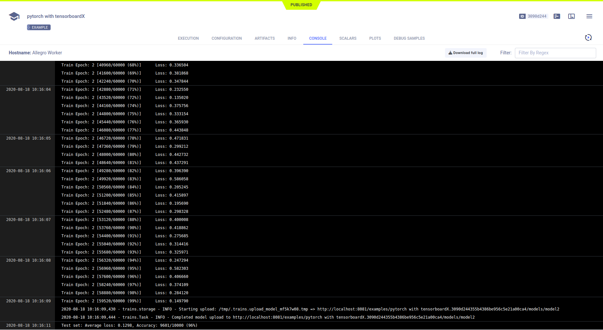

The [pytorch_tensorboardX.py](https://github.com/allegroai/clearml/blob/master/examples/frameworks/tensorboardx/pytorch_tensorboardX.py) 
example demonstrates the integration of **ClearML** into code that uses PyTorch and TensorBoardX. 

The script does the following:
1. Trains a simple deep neural network on the PyTorch built-in [MNIST](https://pytorch.org/vision/stable/datasets.html#mnist) dataset.
1. Creates a TensorBoardX `SummaryWriter` object to log: 
   * Scalars during training 
   * Scalars and debug samples during testing 
   * A test text message to the console (a test message to demonstrate **ClearML**).
1. Creates an experiment named `pytorch with tensorboardX` which is associated with the `examples` project in the **ClearML Web UI**.

## Scalars

The loss and accuracy metric scalar plots appear in the experiment's page in the **ClearML web UI**, under
**RESULTS** **>** **SCALARS**. The also includes resource utilization plots, which are titled **:monitor: machine**.

## Hyperparameters

**ClearML** automatically logs command line options defined with `argparse`. They appear in **CONFIGURATIONS** **>** 
**HYPER PARAMETERS** **>** **Args**.

## Console

Text printed to the console for training progress, as well as all other console output, appear in **RESULTS** **>** **CONSOLE**.

## Artifacts

Model artifacts associated with the experiment appear in the info panel of the **EXPERIMENTS** tab and in the info panel 
of the **MODELS** tab.  

The experiment info panel shows model tracking, including the model name and design (in this case, no design was stored).

The model info panel contains the model details, including: 
* Model URL
* Framework 
* Snapshot locations.

