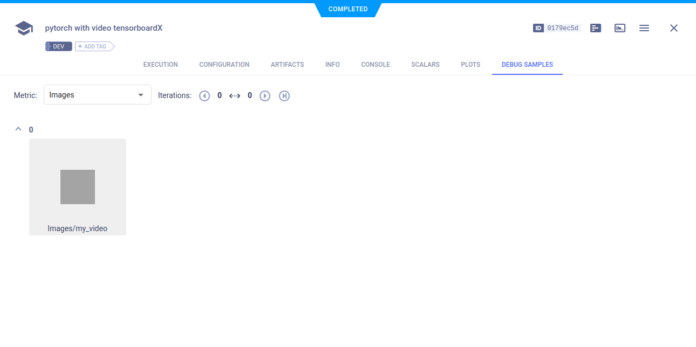

The [moveiepy_tensorboardx.py](https://github.com/allegroai/clearml/blob/master/examples/frameworks/tensorboardx/moviepy_tensorboardx.py)
example demonstrates the integration of ClearML into code, which creates a TensorBoardX `SummaryWriter` object to log 
video data. 

When the script runs, it creates an experiment named `pytorch with video tensorboardX`, which is associated with 
the `examples` project. 

## Debug Samples

ClearML automatically captures the video data that is added to the `SummaryWriter` object, using the `add_video` method. 
The video appears in the experiment page in the ClearML web UI under **RESULTS > DEBUG SAMPLES**.

