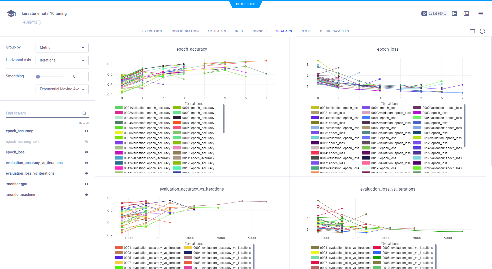
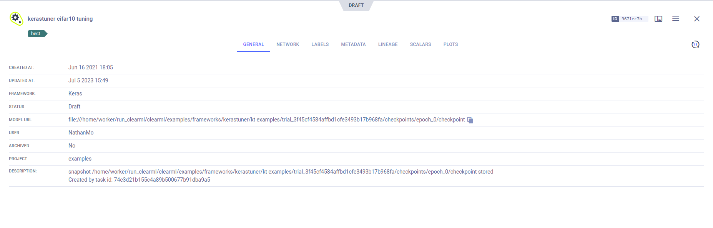
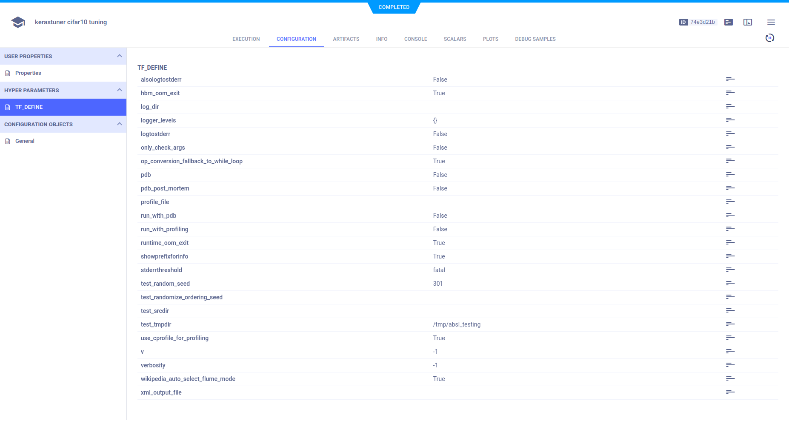

Integrate ClearML into code that uses [Keras Tuner](https://www.tensorflow.org/tutorials/keras/keras_tuner). By 
specifying `ClearMLTunerLogger` (see [kerastuner.py](https://github.com/allegroai/clearml/blob/master/clearml/external/kerastuner.py)) 
as the Keras Tuner logger, ClearML automatically logs scalars and hyperparameter optimization.  

## ClearMLTunerLogger

Take a look at [keras_tuner_cifar.py](https://github.com/allegroai/clearml/blob/master/examples/frameworks/kerastuner/keras_tuner_cifar.py) 
example script, which demonstrates the integration of ClearML in a code that uses Keras Tuner. 

The script does the following:
1. Creates a `Hyperband` object, which uses Keras Tuner's `Hyperband` tuner. It finds the best hyperparameters to train a 
   network on a CIFAR10 dataset.
1. When the `Hyperband` object is created, instantiates a `ClearMLTunerLogger` object and assigns it to the `Hyperband` logger.
The `ClearMLTunerLogger` class provides the required binding for ClearML automatic logging. 

```python
tuner = kt.Hyperband(
    build_model,
    project_name='kt examples',
    logger=ClearMLTunerLogger(),
    objective='val_accuracy',
    max_epochs=10,
    hyperband_iterations=6)
```

When the script runs, it logs: 
* Tabular summary of hyperparameters tested and their metrics by trial ID
* Scalar plot showing metrics for all runs
* Summary plot
* Output model with configuration and snapshot location.

## Scalars

ClearML logs the scalars from training each network. They appear in the project's page in the **ClearML web UI**, under
**SCALARS**.



## Summary of Hyperparameter Optimization

ClearML automatically logs the parameters of each experiment run in the hyperparameter search. They appear in tabular 
form in **PLOTS**.


## Artifacts

ClearML automatically stores the output model. It appears in **ARTIFACTS** **>** **Output Model**.


Model details, such as snap locations, appear in the **MODELS** tab.



The model configuration is stored with the model.


## Configuration Objects

### Hyperparameters

ClearML automatically logs the TensorFlow Definitions, which appear in **CONFIGURATION** **>** **HYPERPARAMETERS**.



### Configuration

The Task configuration appears in **CONFIGURATION** **>** **General**.


