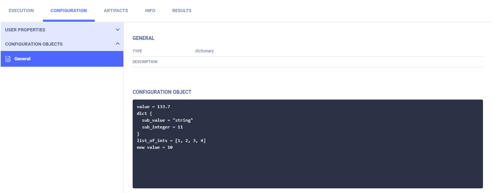
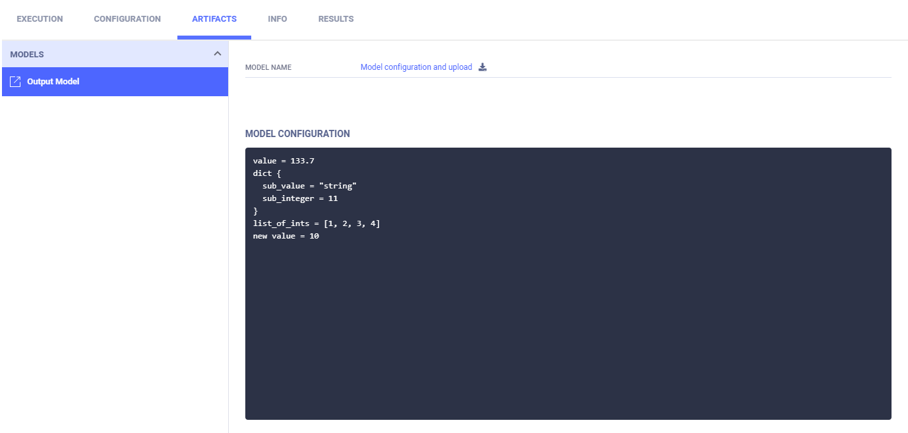
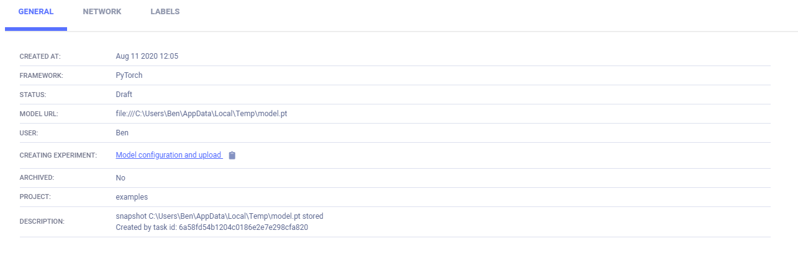
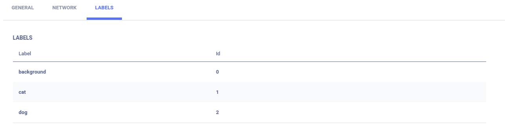

The [manual_model_upload.py](https://github.com/allegroai/clearml/blob/master/examples/frameworks/tensorflow/manual_model_upload.py) 
example demonstrates **ClearML**'s tracking of a manually configured model created with TensorFlow, including: 
* Model checkpoints (snapshots)
* Hyperparameters
* Output to the console. 
  
When the script runs, it creates an experiment named `Model configuration and upload`, which is associated with the `examples` project.

Configure **ClearML** for model checkpoints (model snapshot) storage in any of the following ways ([debug sample](../../../references/sdk/logger.md#set_default_upload_destination) 
storage is different):

* In the configuration file, set [default_output_uri](../../../configs/clearml_conf.md#sdkdevelopment).
* In code, when [initializing a Task](../../../references/sdk/task.md#taskinit), use the `output_uri` parameter.
* In the **ClearML Web UI**, when [modifying an experiment](../../../webapp/webapp_exp_tuning.md#output-destination).

## Configuration

This example shows two ways to connect a configuration, using the [Task.connect_configuration](../../../references/sdk/task.md#connect_configuration) method:

* Connect a configuration file by providing the file's path. **ClearML Server** stores a copy of the file.
```python
# Connect a local configuration file
config_file = os.path.join('..', '..', 'reporting', 'data_samples', 'sample.json')
config_file = task.connect_configuration(config_file)
```

* Create a configuration dictionary and provide the dictionary.
```python
model_config_dict = {
    'value': 13.37,
    'dict': {'sub_value': 'string', 'sub_integer': 11},
    'list_of_ints': [1, 2, 3, 4],
}
model_config_dict = task.connect_configuration(model_config_dict)
```

If the configuration changes, **ClearML** track it.

```python
model_config_dict['new value'] = 10
model_config_dict['value'] *= model_config_dict['new value']
```


The configuration appears in the experiment's page in the **ClearML web UI**, under **CONFIGURATIONS** **>** 
**CONFIGURATION OBJECTS**.



The output model's configuration appears in **ARTIFACTS** **>** **Output Model**.

## Artifacts

Model artifacts associated with the experiment appear in the info panel of the **EXPERIMENTS** tab) and in the info panel 
of the **MODELS** tab.  

The experiment info panel shows model tracking, including the model name and design (in this case, no design was stored).



The model info panel contains the model details, including: 
* Model design 
* label enumeration 
* Model URL 
* Framework
* Snapshot locations.

### General model information



### Label enumeration

Connect a label enumeration dictionary by calling the [Task.connect_label_enumeration](../../../references/sdk/task.md#connect_label_enumeration) method.

```python
# store the label enumeration of the training model
labels = {'background': 0, 'cat': 1, 'dog': 2}
task.connect_label_enumeration(labels)
``` 

