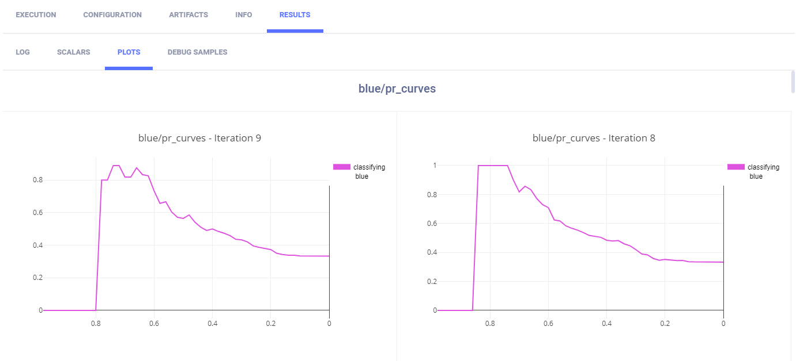
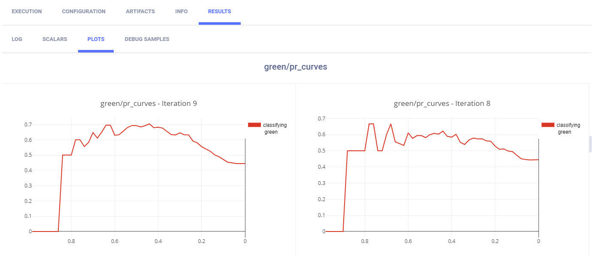
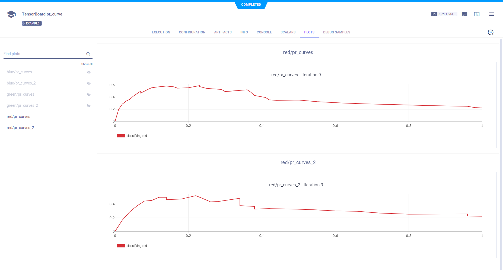
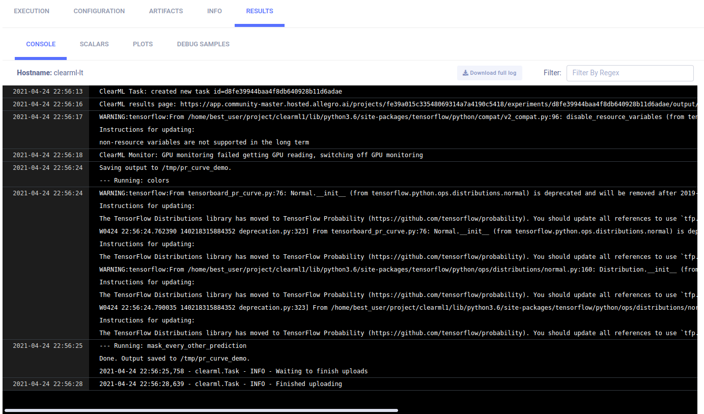

The [tensorboard_pr_curve.py](https://github.com/allegroai/clearml/blob/master/examples/frameworks/tensorflow/tensorboard_pr_curve.py) 
example demonstrates the integration of ClearML into code that uses TensorFlow and TensorBoard. 

The example script does the following:
* Creates an experiment named `tensorboard pr_curve` in the `examples` project.
* Creates three classes, R, G, and B, and generates colors within the RGB space from normal distributions. The true 
  label of each random color is associated with the normal distribution that generated it.
* Computes the probability that each color belongs to the class, using three other normal distributions.
* Generate PR curves using those probabilities. 
* Creates a summary per class using [tensorboard.plugins.pr_curve.summary](https://github.com/tensorflow/tensorboard/blob/master/tensorboard/plugins/pr_curve/summary.py), 
* ClearML automatically captures TensorBoard output, TensorFlow Definitions, and output to the console

## Plots

In the **ClearML Web UI**, the PR Curve summaries appear in the experiment's page under **PLOTS**.

* Blue PR curves
    
* Green PR curves
    
* Red PR curves
    

## Hyperparameters

ClearML automatically logs TensorFlow Definitions. They appear in **CONFIGURATION** **>** **HYPERPARAMETERS** **>** **TF_DEFINE**.

## Console

All other console output appears in **CONSOLE**.

