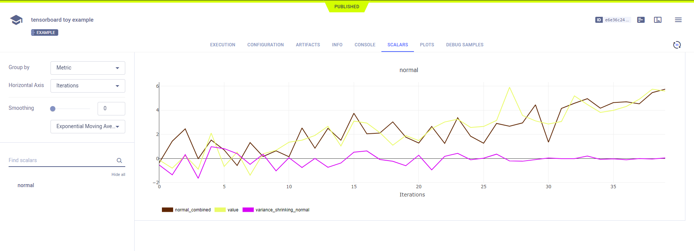
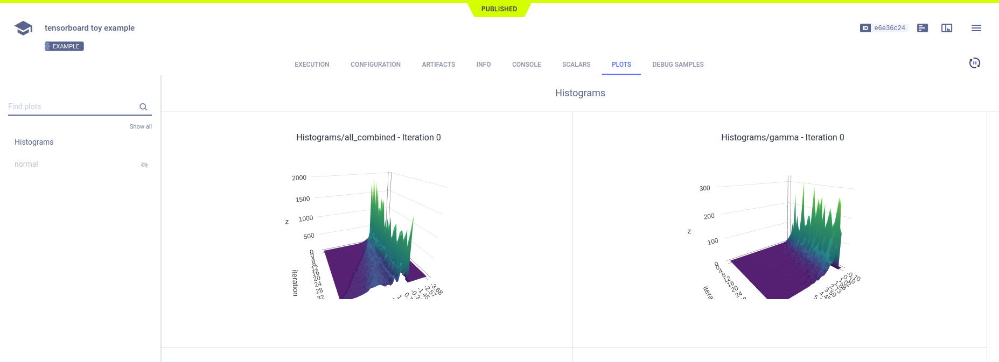
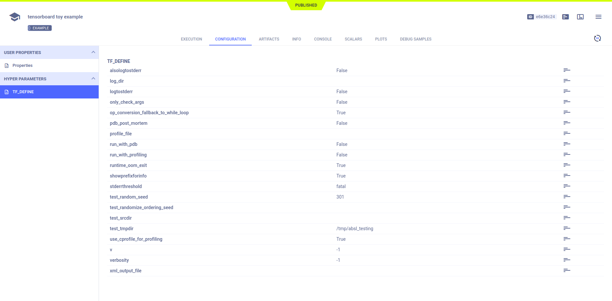

The [tensorboard_toy.py](https://github.com/allegroai/clearml/blob/master/examples/frameworks/tensorflow/tensorboard_toy.py) 
example demonstrates **ClearML**'s automatic logging of TensorBoard scalars, histograms, images, and text, as well as 
all other console output and TensorFlow Definitions. 

The script uses `tf.summary.create_file_writer` with the following:

* `tf.summary.histogram`
* `tf.summary.scalar`
* `tf.summary.text`
* `tf.summary.image`

When the script runs, it creates an experiment named `tensorboard toy example`, which is associated with the `examples` 
project.

## Scalars

The `tf.summary.scalar` output appears in the experiment's page in the **ClearML web UI** under **RESULTS** **>** 
**SCALARS**. Resource utilization plots, which are titled **:monitor: machine**, also appear in the **SCALARS** tab.

## Plots

The `tf.summary.histogram` output appears in **RESULTS** **>** **PLOTS**.

## Debug Samples

**ClearML** automatically tracks images and text output to TensorFlow. They appear in **RESULTS** **>** **DEBUG SAMPLES**.

## Hyperparameters

**ClearML** automatically logs TensorFlow Definitions. They appear in **CONFIGURATIONS** **>** **HYPER PARAMETERS** **>** 
**TF_DEFINE**.

