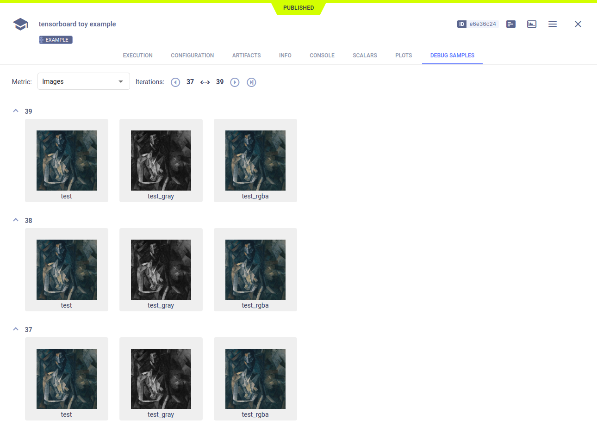

The [tensorboard_toy.py](https://github.com/allegroai/clearml/blob/master/examples/frameworks/tensorflow/tensorboard_toy.py) 
example demonstrates ClearML's automatic logging of TensorBoard scalars, histograms, images, and text, as well as 
all other console output and TensorFlow Definitions. 

When the script runs, it creates an experiment named `tensorboard toy example` in the `examples` 
project.

## Scalars

The `tf.summary.scalar` output appears in the ClearML web UI, in the experiment's 
**SCALARS**. Resource utilization plots, which are titled **:monitor: machine**, also appear in the **SCALARS** tab.

## Plots

The `tf.summary.histogram` output appears in **PLOTS**.

## Debug Samples

ClearML automatically tracks images and text output to TensorFlow. They appear in **DEBUG SAMPLES**.

## Hyperparameters

ClearML automatically logs TensorFlow Definitions. They appear in **CONFIGURATION** **>** **HYPERPARAMETERS** **>** 
**TF_DEFINE**.

