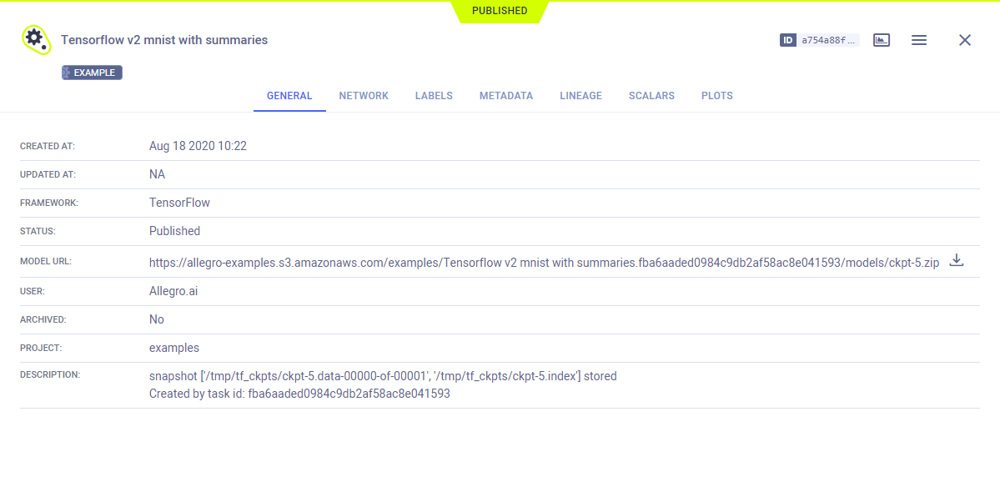

The [tensorflow_mnist.py](https://github.com/allegroai/clearml/blob/master/examples/frameworks/tensorflow/tensorflow_mnist.py) 
example demonstrates the integration of ClearML into code that uses TensorFlow and Keras to train a neural network on 
the Keras built-in [MNIST](https://www.tensorflow.org/api_docs/python/tf/keras/datasets/mnist) handwritten digits dataset. 

When the script runs, it creates an experiment named `Tensorflow v2 mnist with summaries` in the `examples` project.

## Scalars

The loss and accuracy metric scalar plots appear in the experiment's page in the **ClearML web UI** under 
**SCALARS**. Resource utilization plots, which are titled **:monitor: machine**, also appear in the **SCALARS** tab.

## Hyperparameters

ClearML automatically logs TensorFlow Definitions. They appear in **CONFIGURATION** **>** **HYPERPARAMETERS** 
**>** **TF_DEFINE**.

## Console

All console output appears in **CONSOLE**.

## Artifacts

Models created by the experiment appear in the experiment’s **ARTIFACTS** tab. ClearML automatically logs and tracks 
models and any snapshots created using TensorFlow. 

Clicking on a model’s name takes you to the [model’s page](../../../webapp/webapp_model_viewing.md), where you can 
view the model’s details and access the model.

