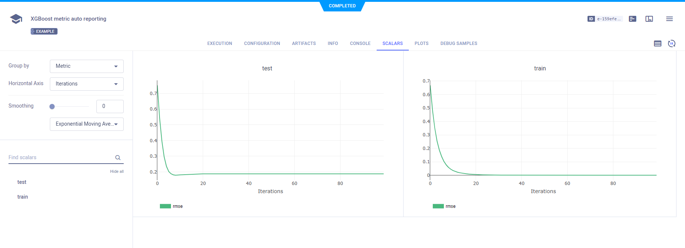

The [xgboost_metrics.py](https://github.com/allegroai/clearml/blob/master/examples/frameworks/xgboost/xgboost_metrics.py) 
example demonstrates the integration of ClearML into code that uses XGBoost to train a network on the scikit-learn [iris](https://scikit-learn.org/stable/modules/generated/sklearn.datasets.load_iris.html#sklearn.datasets.load_iris) 
classification dataset. ClearML automatically captures models and scalars logged with XGBoost.

When the script runs, it creates a ClearML experiment named `xgboost metric auto reporting`, which is associated with 
the `examples` project.

## Scalars
ClearML automatically captures scalars logged with XGBoost, which can be visualized in plots in the 
ClearML WebApp, in the experiment's **RESULTS > SCALARS** page.

## Models

ClearML automatically captures the model logged using the `xgboost.save` method, and saves it as an artifact.

View saved snapshots in the experiment's **ARTIFACTS** tab.

 

To view the model details, click the model name in the **ARTIFACTS** page, which will open the model's info tab. Alternatively, download the model.

## Console

All console output during the script’s execution appears in the experiment’s **RESULTS > CONSOLE** page.

