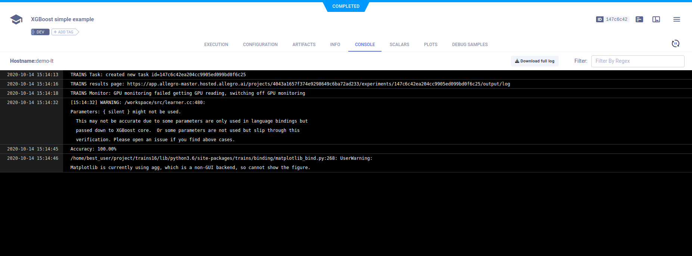
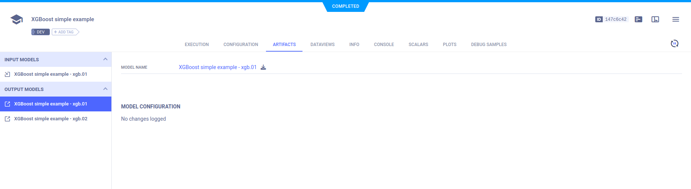

The [xgboost_sample.py](https://github.com/allegroai/clearml/blob/master/examples/frameworks/xgboost/xgboost_sample.py) 
example demonstrates integrating **ClearML** into code that trains a network on the scikit-learn [iris](https://scikit-learn.org/stable/modules/generated/sklearn.datasets.load_iris.html#sklearn.datasets.load_iris) 
classification dataset, using XGBoost to do the following:

* Load a model ([xgboost.Booster.load_model](https://xgboost.readthedocs.io/en/latest/python/python_api.html#xgboost.Booster.load_model))
* Save a model ([xgboost.Booster.save_model](https://xgboost.readthedocs.io/en/latest/python/python_api.html#xgboost.Booster.save_model))
* Dump a model to JSON or text file ([xgboost.Booster.dump_model](https://xgboost.readthedocs.io/en/latest/python/python_api.html#xgboost.Booster.dump_model))
* Plot feature importance ([xgboost.plot_importance](https://xgboost.readthedocs.io/en/latest/python/python_api.html#xgboost.plot_importance))
* Plot a tree ([xgboost.plot_tree](https://xgboost.readthedocs.io/en/latest/python/python_api.html#xgboost.plot_tree))

And using scikit-learn to score accuracy ([sklearn.metrics.accuracy_score](https://scikit-learn.org/stable/modules/generated/sklearn.metrics.accuracy_score.html)).

**ClearML** automatically logs:
* Input model
* Output model 
* Model checkpoints (snapshots) 
* Feature importance plot 
* Tree plot
* Output to console.

When the script runs, it creates an experiment named `XGBoost simple example`, which is associated with the `examples` project.

## Plots

The feature importance plot and tree plot appear in the project's page in the **ClearML web UI**, under **RESULTS** **>** 
**PLOTS**.

## Console

All other console output appear in **RESULTS** **>** **CONSOLE**.

## Artifacts

Model artifacts associated with the experiment appear in the info panel of the **EXPERIMENTS** tab and in the info panel 
of the **MODELS** tab.  

The experiment info panel shows model tracking, including the model name and design (in this case, no design was stored).

The model info panel contains the model details, including: 
* Model design
* Label enumeration
* Model URL
* Framework.

