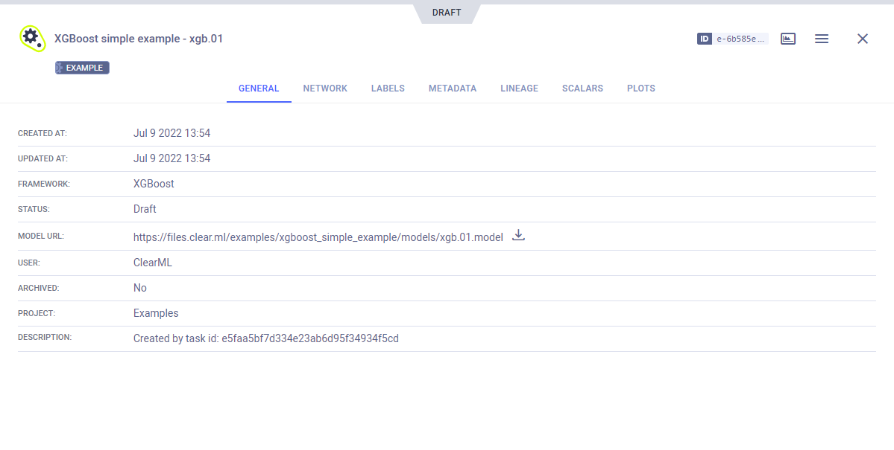

The [xgboost_sample.py](https://github.com/allegroai/clearml/blob/master/examples/frameworks/xgboost/xgboost_sample.py) 
example demonstrates integrating ClearML into code that uses [XGBoost](https://xgboost.readthedocs.io/en/stable/). 

The example does the following:
* Trains a network on the scikit-learn [iris](https://scikit-learn.org/stable/modules/generated/sklearn.datasets.load_iris.html#sklearn.datasets.load_iris) 
classification dataset using XGBoost
* Scores accuracy using scikit-learn
* ClearML automatically logs the input model registered by XGBoost, and the output model (and its checkpoints), 
  feature importance plot, and tree plot created with XGBoost. 
* Creates an experiment named `XGBoost simple example`, which is associated with the `examples` project.

## Plots

The feature importance plot and tree plot appear in the project's page in the **ClearML web UI**, under 
**PLOTS**.

## Console

All other console output appear in **CONSOLE**.

## Artifacts

Models created by the experiment appear in the experiment’s **ARTIFACTS** tab. ClearML automatically logs and tracks 
models and any snapshots created using XGBoost. 

Clicking on the model's name takes you to the [model’s page](../../../webapp/webapp_model_viewing.md), where you can 
view the model’s details and access the model.

