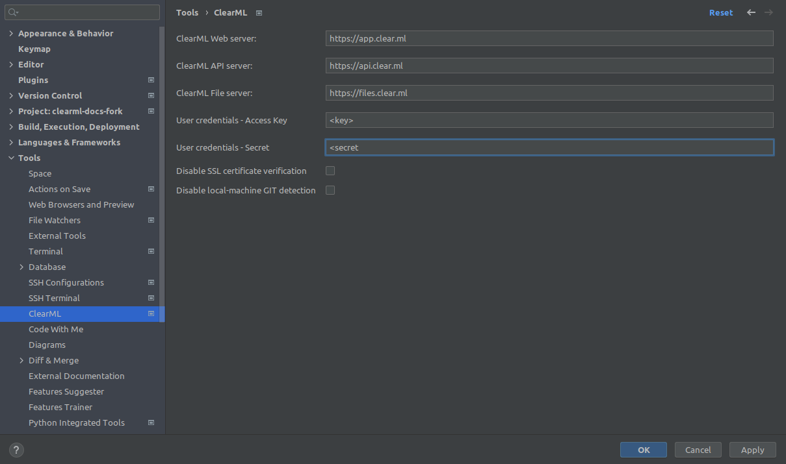

The **ClearML PyCharm plugin** enables syncing a local execution configuration to a remote executor machine:

* Sync local repository information to a remote machine - When using PyCharm to run/debug code remotely using 
an SSH connection, PyCharm copies the code base into the remote machine and runs it there. PyCharm does not copy 
the `.git` folder into the remote machine, so ClearML can't detect the correct git repository details when running on the 
remote machine. The ClearML PyCharm plugin detects the git details on the local 
machine, and passes that information to the remote machine to be registered to a [task](../../fundamentals/task.md).

* Pass user credentials to a remote machine - Multiple users can use the same resource for execution without compromising 
private credentials (assuming the entire code base, including `.git` already exists on the remote machine)

* Run the [ClearML Agent](../../clearml_agent.md) on default VMs/Containers.

## Installation

1. Download the latest plugin version from the [Releases page](https://github.com/allegroai/clearml-pycharm-plugin/releases). 

1. Install the plugin in PyCharm from local disk:

## Optional: ClearML Configuration Parameters

:::warning
If you set ClearML configuration parameters (ClearML Server and ClearML credentials) in the plugin, they will override 
the settings in the ClearML configuration file.
:::

**To set ClearML configuration parameters:**

1. In PyCharm, open **Settings** **>** **Tools** **>** ClearML.

1. Configure your ClearML server information:
    1. API server (for example: ``http://localhost:8008``)
    1. Web server (for example: ``http://localhost:8080``)
    1. File server  (for example: ``http://localhost:8081``)
    
1. Add ClearML user credentials key/secret.

1. Check box to disable SSL certificate verification (for on-prem `clearml-server` installations).

1. Check box to disable local git detection. The PyCharm plugin is often used to run git detection on the local machine 
since there is no `.git` folder on the remote machine. In the case that the plugin is used just for passing configuration 
to a remote SSH machine, there is no need to run the git detection on the local machine.

