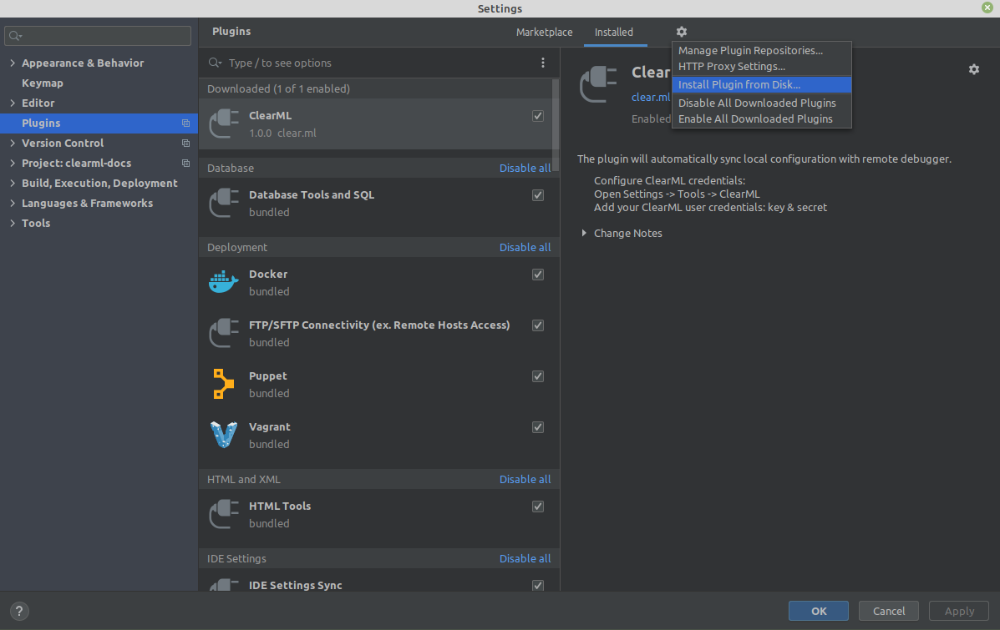
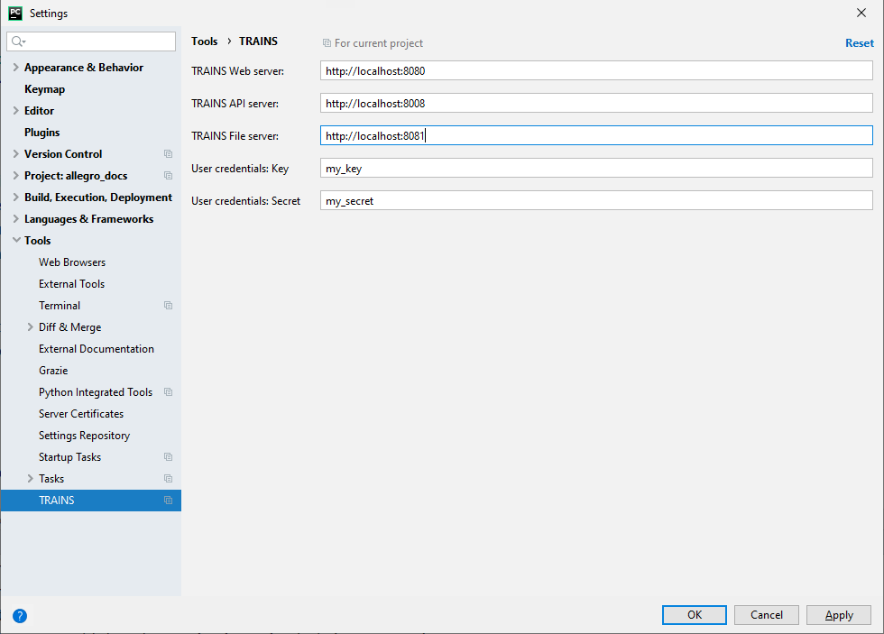

The **ClearML PyCharm plugin** enables syncing a local execution configuration to a remote execution machine:

* Sync local repository information to a remote debug machine.

* Multiple users can use the same resource for execution without compromising private credentials.

* Run the [ClearML Agent](../../fundamentals/agents_and_queues.md) on default VMs/Containers.

## Installation

**To install the ClearML PyCharm plugin, do the following:**

1. Download the latest plugin version from the [Releases page](https://github.com/allegroai/clearml-pycharm-plugin/releases). 

1. Install the plugin in PyCharm from local disk:

## Optional: ClearML configuration parameters

:::warning
If you set ClearML configuration parameters (ClearML Server and ClearML credentials) in the plugin, they will override 
the settings in the ClearML configuration file.
:::

**To set ClearML configuration parameters:**

1. In PyCharm, open **Settings**.

1. Click **Tools**.

1. Click **ClearML**.

1. Configure ClearML server information:
    1. API server (for example: ``http://localhost:8008``)
    1. Web server (for example: ``http://localhost:8080``)
    1. File server  (for example: ``http://localhost:8081``)
    
1. Add **ClearML** user credentials key/secret.

