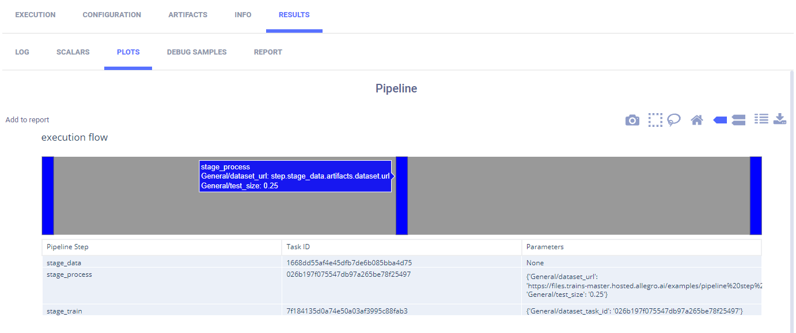

The [pipeline_from_tasks.py](https://github.com/allegroai/clearml/blob/master/examples/pipeline/pipeline_from_tasks.py) 
example demonstrates a simple pipeline, where each step is a [ClearML Task](../../fundamentals/task.md). 

The pipeline is implemented using the [PipelineController](../../references/sdk/automation_controller_pipelinecontroller.md) 
class. Steps are added to a PipelineController object, which launches and monitors the steps when executed.
 
This example incorporates four tasks, each of which is created using a different script:
* **Controller Task** ([pipeline_from_tasks.py](https://github.com/allegroai/clearml/blob/master/examples/pipeline/pipeline_from_tasks.py)) - 
  Implements the pipeline controller, adds the steps (tasks) to the pipeline, and runs the pipeline.
* **Step 1** ([step1_dataset_artifact.py](https://github.com/allegroai/clearml/blob/master/examples/pipeline/step1_dataset_artifact.py)) - 
  Downloads data and stores the data as an artifact.
* **Step 2** ([step2_data_processing.py](https://github.com/allegroai/clearml/blob/master/examples/pipeline/step2_data_processing.py)) - 
  Loads the stored data (from Step 1), processes it, and stores the processed data as artifacts.
* **Step 3** ([step3_train_model.py](https://github.com/allegroai/clearml/blob/master/examples/pipeline/step3_train_model.py)) - 
  Loads the processed data (from Step 2) and trains a network.

When the controller task is executed, it clones the step tasks, and enqueues the newly cloned tasks for execution. Note 
that the base tasks from which the steps are cloned are only used as templates and not executed themselves. Also note 
that for the controller to clone, these base tasks need to exist in the system (as a result of a previous run or using 
[clearml-task](../../apps/clearml_task.md)).

The controller task itself can be run locally, or, if the controller task has already run at least once and is in the 
ClearML Server, the controller can be cloned, and the cloned task can be executed remotely.

The sections below describe in more detail what happens in the controller task and in each step task.

## The Pipeline Controller

1. Create the [pipeline controller](../../references/sdk/automation_controller_pipelinecontroller.md) object.

   ```python
   pipe = PipelineController(
        name='pipeline demo',
        project='examples',
        version='0.0.1',
        add_pipeline_tags=False,
   )
   ```
   * `name` - Name the pipeline controller task
   * `project` - Project where pipeline controller and tasks will be stored 
   * `version` - Provide a pipeline version. If `auto_version_bump` is set to `True`, then the version number will be 
   automatically bumped if the same version already exists. 
   * `add_pipeline_tags` - If `True`, then all pipeline steps are tagged with `pipe: <pipeline_task_id>` 
 
1. Add Step 1 using the [PipelineController.add_step](../../references/sdk/automation_controller_pipelinecontroller.md#add_step) 
   method.
   
   ```python
   pipe.add_step(name='stage_data', base_task_project='examples', base_task_name='pipeline step 1 dataset artifact')
   ``` 
    
   * `name` - The name of Step 1 (`stage_data`).
   * `base_task_project` and `base_task_name` - Step 1's base Task to clone (the cloned Task will be executed when the pipeline runs).

1. Add Step 2.    
   
   ```python
   pipe.add_step(
        name='stage_process', 
        parents=['stage_data', ],
        base_task_project='examples', 
        base_task_name='pipeline step 2 process dataset',
        parameter_override={
            'General/dataset_url': '${stage_data.artifacts.dataset.url}',
            'General/test_size': 0.25
            },
        pre_execute_callback=pre_execute_callback_example,
        post_execute_callback=post_execute_callback_example
   )
   ``` 
   In addition to the parameters included in Step 1, input the following: 
   * `parents` - The names of the steps, which the current step depends upon their completion to begin execution. In this
     instance, the execution of Step 2 (`stage_process`) depends upon the completion of Step 1 (`stage_data`).
   * `parameter_override` - Pass the URL of the data artifact from Step 1 to Step 2. Override the value of  the parameter 
     whose key is `dataset_url` (in the parameter group named `General`). Override it with the URL of the artifact named 
     `dataset`. Also override the test size. 

    :::important Syntax of the parameter_override Value
    For other examples of ``parameter_override`` syntax, see [PipelineController.add_step](../../references/sdk/automation_controller_pipelinecontroller.md#add_step).
    :::
   
   * `pre_execute_callback` - The pipeline controller will execute the input callback function before the pipeline step is
   executed. If the callback function returns `False`, the pipeline step will be skipped.  
   *  `post_execute_callback` - The pipeline controller will execute the input callback function after the pipeline step is
   executed.
      
1. Add Step 3.
                                      
    ```python
    pipe.add_step(
        name='stage_train', 
        parents=['stage_process', ],
        base_task_project='examples', 
        base_task_name='pipeline step 3 train model',
        parameter_override={'General/dataset_task_id': '${stage_process.id}'})
    ```

   * `name` - The name of Step 3 (`stage_train`).
   * `parents` - The start of Step 3 (`stage_train`) depends upon the completion of Step 2 (`stage_process`).
   * `parameter_override` - Pass the ID of the Step 2 Task to the Step 3 Task. This is the ID of the cloned Task, not the base Task.
    
1. Run the pipeline.
   ```python
   # Starting the pipeline (in the background)
   pipe.start()
   ```
   
## Step 1 - Downloading the Data

In the Step 1 Task ([step1_dataset_artifact.py](https://github.com/allegroai/clearml/blob/master/examples/pipeline/step1_dataset_artifact.py)): 
1. Clone base Task and enqueue it for execution using [`Task.execute_remotely`](../../references/sdk/task.md#execute_remotely).
   ```python
   task.execute_remotely()
   ```

1. Download data and store it as an artifact named `dataset`. This is the same artifact name used in `parameter_override`
when the [`add_step`](../../references/sdk/automation_controller_pipelinecontroller.md#add_step) method is called in the pipeline controller.
 
   ```python
   # simulate local dataset, download one, so we have something local
   local_iris_pkl = StorageManager.get_local_copy(
       remote_url='https://github.com/allegroai/events/raw/master/odsc20-east/generic/iris_dataset.pkl'
   )
    
   # add and upload local file containing our toy dataset
   task.upload_artifact('dataset', artifact_object=local_iris_pkl)
   ```
   
## Step 2 - Processing the Data

In the Step 2 Task ([step2_data_processing.py](https://github.com/allegroai/clearml/blob/master/examples/pipeline/step2_data_processing.py)): 
1. Create a parameter dictionary and connect it to the Task.

   ```python 
   args = {
        'dataset_task_id': '',
        'dataset_url': '',
        'random_state': 42,
        'test_size': 0.2,
    }
    
    # store arguments, later we will be able to change them from outside the code
    task.connect(args)
   ```

   The parameter `dataset_url` is the same parameter name used by `parameter_override` when the [`add_step`](../../references/sdk/automation_controller_pipelinecontroller.md#add_step) 
   method is called in the pipeline controller.

1. Clone base Task and enqueue it for execution using [`Task.execute_remotely`](../../references/sdk/task.md#execute_remotely).
   
   ```python
   task.execute_remotely() 
   ```
   
1. Later in Step 2, the Task uses the URL in the parameter dictionary to get the data.
   
   ```python
   iris_pickle = StorageManager.get_local_copy(remote_url=args['dataset_url'])
   ```
   
1. Task Processes data and then stores the processed data as artifacts.
   
   ```python
   task.upload_artifact('X_train', X_train)
   task.upload_artifact('X_test', X_test)
   task.upload_artifact('y_train', y_train)
   task.upload_artifact('y_test', y_test)
   ```
   
## Step 3 - Training the Network

In the Step 3 Task ([step3_train_model.py](https://github.com/allegroai/clearml/blob/master/examples/pipeline/step3_train_model.py)): 
1. Create a parameter dictionary and connect it to the Task.

   ```python
   # Arguments
   args = {
       'dataset_task_id': 'REPLACE_WITH_DATASET_TASK_ID',
   }
   task.connect(args)
   ```
    
   The parameter `dataset_task_id` is later overridden by the ID of the Step 2 Task (cloned Task, not base Task). 

1. Clone the Step 3 base Task and enqueue it using [`Task.execute_remotely`](../../references/sdk/task.md#execute_remotely).
   
   ```python
   task.execute_remotely() 
   ```
   
1. Use the Step 2 Task ID to get the processed data stored in artifacts.
   
   ```python
   dataset_task = Task.get_task(task_id=args['dataset_task_id'])
   X_train = dataset_task.artifacts['X_train'].get()
   X_test = dataset_task.artifacts['X_test'].get()
   y_train = dataset_task.artifacts['y_train'].get()
   y_test = dataset_task.artifacts['y_test'].get()
   ```
    
1. Train the network and log plots, along with ClearML automatic logging.

## Running the Pipeline

**To run the pipeline:**

1. Run the script for each of the steps, if the script has not run once before.

        python step1_dataset_artifact.py
        python step2_data_processing.py
        python step3_train_model.py
    
1. Run the pipeline controller one of the following two ways:

    * Run the script.
     
          python pipeline_from_tasks.py
        
    * Remotely execute the Task - If the Task `pipeline demo` in the project `examples` already exists in ClearML Server, clone it and enqueue it to execute.
    
   :::note
   If you enqueue a Task, make sure an [agent](../../clearml_agent.md) is assigned to the queue, so 
   it will execute the Task.    
   :::

    
The plot appears in **RESULTS** > **PLOTS** describing the pipeline. Hover over a step in the pipeline, and view the name of the step and the parameters overridden by the step.    

