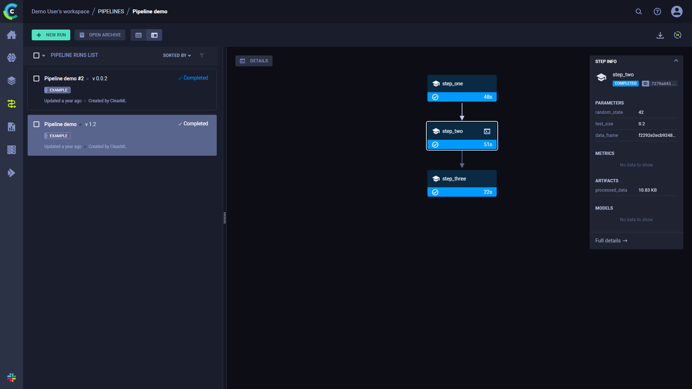
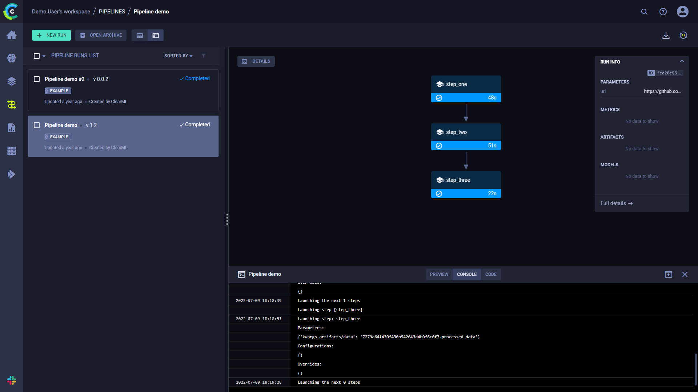

The [pipeline_from_tasks.py](https://github.com/allegroai/clearml/blob/master/examples/pipeline/pipeline_from_tasks.py) 
example demonstrates a simple pipeline, where each step is a [ClearML Task](../../fundamentals/task.md). 

The pipeline is implemented using the [PipelineController](../../references/sdk/automation_controller_pipelinecontroller.md) 
class. Steps are added to a PipelineController object, which launches and monitors the steps when executed.
 
This example incorporates four tasks, each of which is created using a different script:
* **Controller Task** ([pipeline_from_tasks.py](https://github.com/allegroai/clearml/blob/master/examples/pipeline/pipeline_from_tasks.py)) - 
  Implements the pipeline controller, adds the steps (tasks) to the pipeline, and runs the pipeline.
* **Step 1** ([step1_dataset_artifact.py](https://github.com/allegroai/clearml/blob/master/examples/pipeline/step1_dataset_artifact.py)) - 
  Downloads data and stores the data as an artifact.
* **Step 2** ([step2_data_processing.py](https://github.com/allegroai/clearml/blob/master/examples/pipeline/step2_data_processing.py)) - 
  Loads the stored data (from Step 1), processes it, and stores the processed data as artifacts.
* **Step 3** ([step3_train_model.py](https://github.com/allegroai/clearml/blob/master/examples/pipeline/step3_train_model.py)) - 
  Loads the processed data (from Step 2) and trains a network.

When the controller task is executed, it clones the step tasks, and enqueues the newly cloned tasks for execution. Note 
that the base tasks from which the steps are cloned are only used as templates and not executed themselves. Also note 
that for the controller to clone, these base tasks need to exist in the system (as a result of a previous run or using 
[clearml-task](../../apps/clearml_task.md)).

The controller task itself can be run locally, or, if the controller task has already run at least once and is in the 
ClearML Server, the controller can be cloned, and the cloned task can be executed remotely.

The sections below describe in more detail what happens in the controller task and in each step task.

## The Pipeline Controller

1. Create the [pipeline controller](../../references/sdk/automation_controller_pipelinecontroller.md) object.

   ```python
   pipe = PipelineController(
        name='pipeline demo',
        project='examples',
        version='0.0.1',
        add_pipeline_tags=False,
   )
   ```

1. Set the default execution queue to be used. All the pipeline steps will be enqueued for execution in this queue.

   ```python
   pipe.set_default_execution_queue('default')
   ```
   
1. Build the pipeline (see [PipelineController.add_step](../../references/sdk/automation_controller_pipelinecontroller.md#add_step) 
   method for complete reference):

   The pipeline’s [first step](#step-1---downloading-the-datae) uses the pre-existing task 
   `pipeline step 1 dataset artifact` in the `examples` project. The step uploads local data and stores it as an artifact.

   ```python
   pipe.add_step(
        name='stage_data', 
        base_task_project='examples', 
        base_task_name='pipeline step 1 dataset artifact'
   )
   ```
   
   The [second step](#step-2---processing-the-data) uses the pre-existing task `pipeline step 2 process dataset` in 
   the `examples` project. The second step’s dependency upon the first step’s completion is designated by setting it as 
   its parent. 

   Custom configuration values specific to this step execution are defined through the `parameter_override` parameter, 
   where the first step’s artifact is fed into the second step.

   Special pre-execution and post-execution logic is added for this step through the use of `pre_execute_callback` 
   and  `post_execute_callback` respectively. 

   ```python
   pipe.add_step(
        name='stage_process',
        parents=['stage_data', ],
        base_task_project='examples',
        base_task_name='pipeline step 2 process dataset',
        parameter_override={
            'General/dataset_url': '${stage_data.artifacts.dataset.url}',
            'General/test_size': 0.25
            },
        pre_execute_callback=pre_execute_callback_example,
        post_execute_callback=post_execute_callback_example
   )
   ```

   The [third step](#step-3---training-the-network) uses the pre-existing task `pipeline step 3 train model` in the 
   `examples` projects. The step uses Step 2’s artifacts.
   
1. Run the pipeline.
   
   ```python
   pipe.start()
   ```
   
   The pipeline launches remotely, through the services queue, unless otherwise specified.
   
## Step 1 - Downloading the Data

The pipeline’s first step ([step1_dataset_artifact.py](https://github.com/allegroai/clearml/blob/master/examples/pipeline/step1_dataset_artifact.py))
does the following: 

1. Download data using [`StorageManager.get_local_copy`](../../references/sdk/storage.md#storagemanagerget_local_copy) 
  
   ```python
   # simulate local dataset, download one, so we have something local
   local_iris_pkl = StorageManager.get_local_copy(
       remote_url='https://github.com/allegroai/events/raw/master/odsc20-east/generic/iris_dataset.pkl'
   )
   ```    
1. Store the data as an artifact named `dataset` using  [`Task.upload_artifact`](../../references/sdk/task.md#upload_artifact)
   ```python
   # add and upload local file containing our toy dataset
   task.upload_artifact('dataset', artifact_object=local_iris_pkl)
   ```
   
## Step 2 - Processing the Data

The pipeline's second step ([step2_data_processing.py](https://github.com/allegroai/clearml/blob/master/examples/pipeline/step2_data_processing.py))
does the following: 

1. Connect its configuration parameters with the ClearML task:

   ```python 
   args = {
        'dataset_task_id': '',
        'dataset_url': '',
        'random_state': 42,
        'test_size': 0.2,
    }
    
    # store arguments, later we will be able to change them from outside the code
    task.connect(args)
   ```

1. Download the data created in the previous step (specified through the `dataset_url` parameter) using 
   [`StorageManager.get_local_copy`](../../references/sdk/storage.md#storagemanagerget_local_copy) 
   
   ```python
   iris_pickle = StorageManager.get_local_copy(remote_url=args['dataset_url'])
   ```
   
1. Generate testing and training sets from the data and store them as artifacts.
   
   ```python
   task.upload_artifact('X_train', X_train)
   task.upload_artifact('X_test', X_test)
   task.upload_artifact('y_train', y_train)
   task.upload_artifact('y_test', y_test)
   ```
   
## Step 3 - Training the Network

The pipeline's third step ([step3_train_model.py](https://github.com/allegroai/clearml/blob/master/examples/pipeline/step3_train_model.py))
does the following: 
1. Connect its configuration parameters with the ClearML task. This allows the [pipeline controller](#the-pipeline-controller) 
   to override the `dataset_task_id` value as the pipeline is run. 

   ```python
   # Arguments
   args = {
       'dataset_task_id': 'REPLACE_WITH_DATASET_TASK_ID',
   }
   task.connect(args)
   ```
   
1. Clone the base task and enqueue it using [`Task.execute_remotely`](../../references/sdk/task.md#execute_remotely).
   
   ```python
   task.execute_remotely() 
   ```
   
1. Access the data created in the previous task.
   
   ```python
   dataset_task = Task.get_task(task_id=args['dataset_task_id'])
   X_train = dataset_task.artifacts['X_train'].get()
   X_test = dataset_task.artifacts['X_test'].get()
   y_train = dataset_task.artifacts['y_train'].get()
   y_test = dataset_task.artifacts['y_test'].get()
   ```
    
1. Train the network and log plots.

## Running the Pipeline

**To run the pipeline:**

1. If the pipeline steps tasks do not yet exist, run their code to create the ClearML tasks.
   ```bash
   python step1_dataset_artifact.py
   python step2_data_processing.py
   python step3_train_model.py
   ``` 
   
1. Run the pipeline controller.
   
   ```bash
   python pipeline_from_tasks.py
   ```     
    
   :::note
   If you enqueue a Task, make sure an [agent](../../clearml_agent.md) is assigned to the queue, so 
   it will execute the Task.    
   :::

    
## WebApp

When the experiment is executed, the terminal returns the task ID, and links to the pipeline controller task page and 
pipeline page. 

```
ClearML Task: created new task id=bc93610688f242ecbbe70f413ff2cf5f
ClearML results page: https://app.clear.ml/projects/462f48dba7b441ffb34bddb783711da7/experiments/bc93610688f242ecbbe70f413ff2cf5f/output/log
ClearML pipeline page: https://app.clear.ml/pipelines/462f48dba7b441ffb34bddb783711da7/experiments/bc93610688f242ecbbe70f413ff2cf5f
```

The pipeline run’s page contains the pipeline’s structure, the execution status of every step, as well as the run’s 
configuration parameters and output.


To view a run’s complete information, click **Full details** on the bottom of the **Run Info** panel, which will open 
the pipeline’s [controller task page](../../webapp/webapp_exp_track_visual.md).

Click a step to see its summary information.



### Console

Click **DETAILS** to view a log of the pipeline controller’s console output.



Click on a step to view its console output. 

