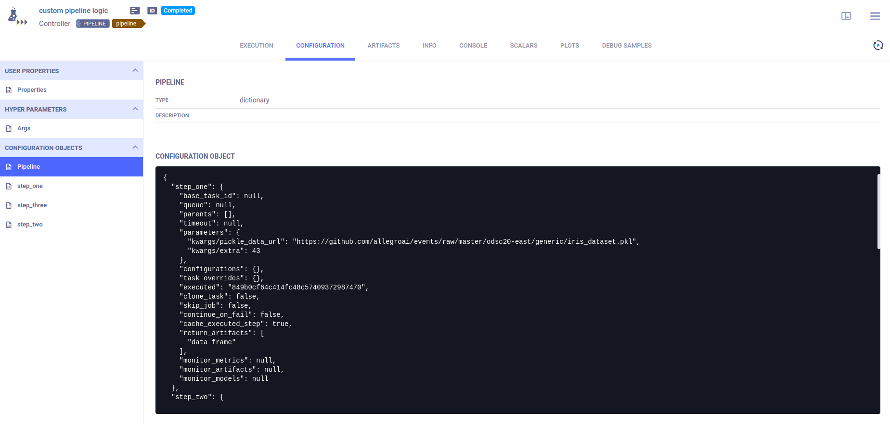
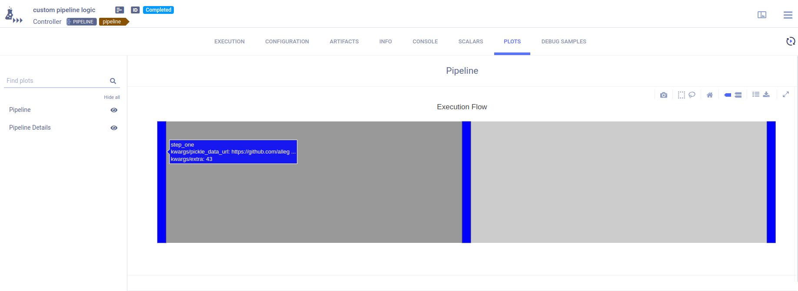
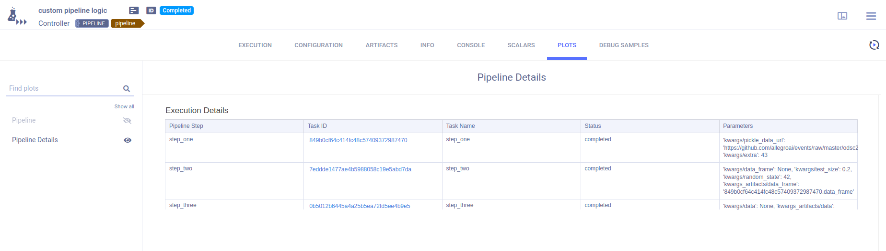
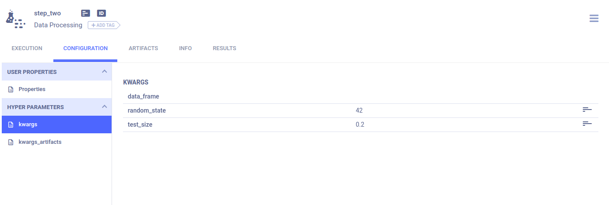
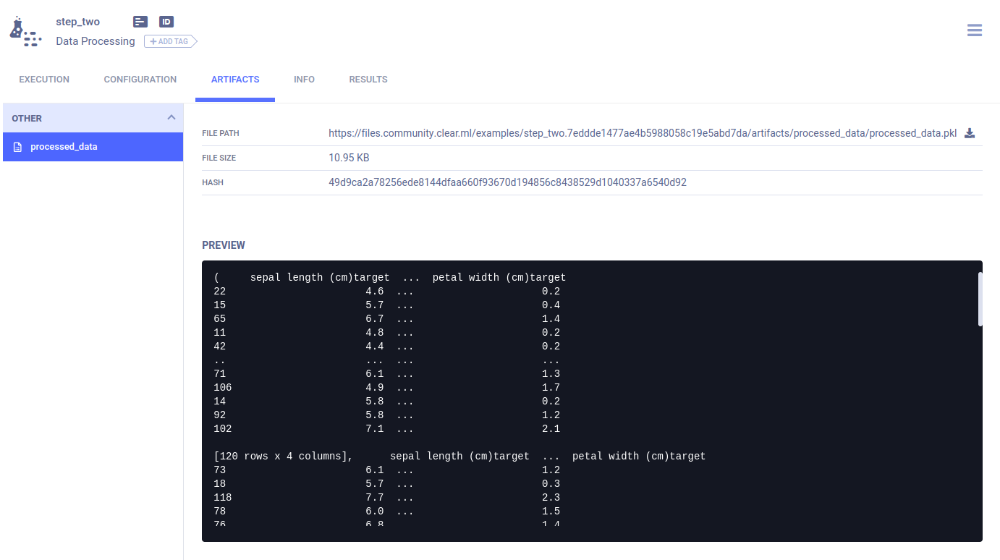

The [pipeline_from_decorator.py](https://github.com/allegroai/clearml/blob/master/examples/pipeline/pipeline_from_decorator.py) 
example demonstrates the creation of a pipeline in ClearML using the [`PipelineDecorator`](../../references/sdk/automation_controller_pipelinecontroller.md#class-automationcontrollerpipelinedecorator)
class. 

This example creates a pipeline incorporating four tasks, each of which is created from a python function using a custom decorator:
* `executing_pipeline`- Implements the pipeline controller which defines the pipeline structure and execution logic.
* `step_one` - Downloads and processes data.
* `step_two` - Further processes the data from `step_one`.
* `step_three` - Uses the processed data from `step_two` to train a model.

The pipeline steps, defined in the `step_one`, `step_two`, and `step_three` functions, are each wrapped with the 
[`@PipelineDecorator.component`](../../references/sdk/automation_controller_pipelinecontroller.md#pipelinedecoratorcomponent) 
decorator, which creates a ClearML pipeline step for each one when the pipeline is executed.

The logic that executes these steps and controls the interaction between them is implemented in the `executing_pipeline` 
function. This function is wrapped with the [`@PipelineDecorator.pipeline`](../../references/sdk/automation_controller_pipelinecontroller.md#pipelinedecoratorpipeline) 
decorator which creates the ClearML pipeline task when it is executed.

The sections below describe in more detail what happens in the pipeline controller and steps.

## Pipeline Controller

In this example, the pipeline controller is implemented by the `executing_pipeline` function.

Using the `@PipelineDecorator.pipeline` decorator creates a ClearML Controller Task from the function when it is executed. 
For detailed information, see [`@PipelineDecorator.pipeline`](../../references/sdk/automation_controller_pipelinecontroller.md#pipelinedecoratorpipeline). 

In the example script, the controller defines the interactions between the pipeline steps in the following way:
1. The controller function passes its argument, `pickle_url`, to the pipeline's first step (`step_one`)
1. The returned data from the first step, `data_frame`, is passed to `step_two`
1. The second step's output, `preprocessed_data`, is modified within the pipeline execution logic 
1. The modified data is passed to the third step, `step_three`.

## Pipeline Steps 
Using the `@PipelineDecorator.component` decorator will make the function a pipeline component that can be called from the 
pipeline controller, which implements the pipeline's execution logic. For detailed information, see [`@PipelineDecorator.component`](../../references/sdk/automation_controller_pipelinecontroller.md#pipelinedecoratorcomponent). 

When the pipeline controller calls a pipeline step, a corresponding ClearML task will be created. For this reason, each 
function which makes up a pipeline step needs to be self-contained. Notice that all package imports inside the function 
will be automatically logged as required packages for the pipeline execution step.

## Pipeline Execution

```python
PipelineDecorator.set_default_execution_queue('default')

# PipelineDecorator.debug_pipeline()

executing_pipeline(
    pickle_url='https://github.com/allegroai/events/raw/master/odsc20-east/generic/iris_dataset.pkl',
)
```

By default, the pipeline controller and the pipeline steps are launched through ClearML [queues](../../fundamentals/agents_and_queues.md#what-is-a-queue). 
Use the [`PipelineDecorator.set_default_execution_queue`](../../references/sdk/automation_controller_pipelinecontroller.md#pipelinedecoratorset_default_execution_queue)
method to specify the execution queue of all pipeline steps. The `execution_queue` parameter of the `@PipelineDecorator.component` 
decorator overrides the default queue value for the specific step for which it was specified.

:::note Execution Modes
ClearML provides different pipeline execution modes to accommodate development and production use cases. For additional 
details, see [Execution Modes](../../fundamentals/pipelines.md#pipeline-controller-execution-options).
:::

To run the pipeline, call the pipeline controller function.

## WebApp

### Pipeline Controller
The pipeline controller’s **CONFIGURATION** page contains the pipeline structure and step definitions in its **Configuration Objects** 
section.

The **Pipeline** configuration object contains the pipeline structure and execution parameters.



An additional configuration object per pipeline step contains the step’s definitions and execution parameters.

The pipeline controller’s **RESULTS > PLOTS** page provides summary details for the pipeline execution.

The **Execution Flow** graphically summarizes the pipeline's execution. Hover over each step to view its details.



The **Execution Details** table provides the pipeline execution details in table format. 



### Pipeline Steps 
Each function step’s arguments are stored in their respective task’s **CONFIGURATION > HYPER PARAMETERS > kwargs**. 




Values that were listed in the `return_values`parameter of the `@PipelineDecorator.component` decorator are stored as 
artifacts in the relevant step's task. These artifacts can be viewed in the step task’s **ARTIFACTS** tab. 


