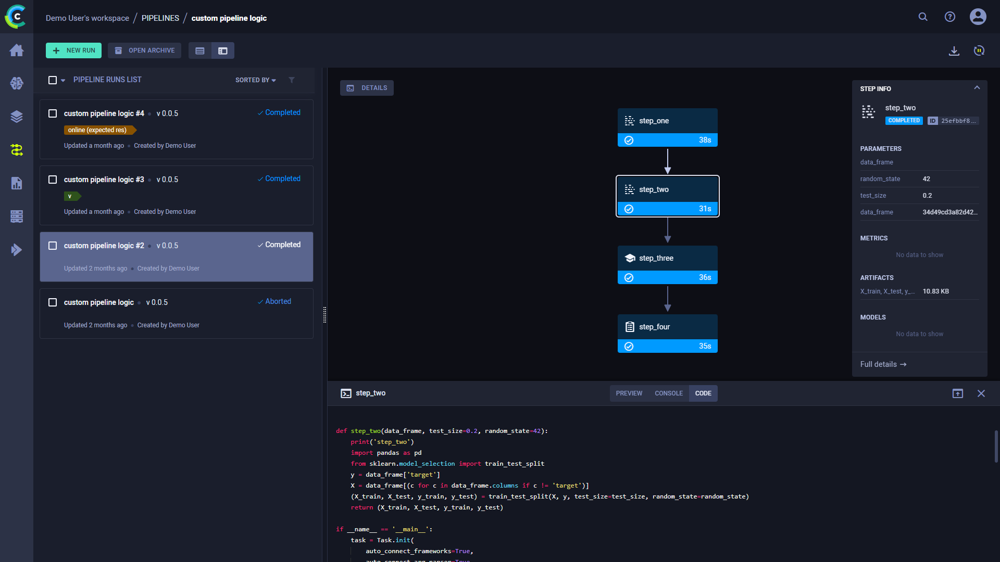

The [pipeline_from_decorator.py](https://github.com/allegroai/clearml/blob/master/examples/pipeline/pipeline_from_decorator.py) 
example demonstrates the creation of a pipeline in ClearML using the [`PipelineDecorator`](../../references/sdk/automation_controller_pipelinecontroller.md#class-automationcontrollerpipelinedecorator)
class. 

This example creates a pipeline incorporating four tasks, each of which is created from a python function using a custom decorator:
* `executing_pipeline`- Implements the pipeline controller which defines the pipeline structure and execution logic.
* `step_one` - Downloads and processes data.
* `step_two` - Further processes the data from `step_one`.
* `step_three` - Uses the processed data from `step_two` to train a model.
* `step_four` - Uses data from `step_two` and the model from `step_three` to make a prediction.

The pipeline steps, defined in the `step_one`, `step_two`, `step_three`, and `step_four` functions, are each wrapped with the 
[`@PipelineDecorator.component`](../../references/sdk/automation_controller_pipelinecontroller.md#pipelinedecoratorcomponent) 
decorator, which creates a ClearML pipeline step for each one when the pipeline is executed.

The logic that executes these steps and controls the interaction between them is implemented in the `executing_pipeline` 
function. This function is wrapped with the [`@PipelineDecorator.pipeline`](../../references/sdk/automation_controller_pipelinecontroller.md#pipelinedecoratorpipeline) 
decorator which creates the ClearML pipeline task when it is executed.

The sections below describe in more detail what happens in the pipeline controller and steps.

## Pipeline Controller

In this example, the pipeline controller is implemented by the `executing_pipeline` function.

Using the `@PipelineDecorator.pipeline` decorator creates a ClearML Controller Task from the function when it is executed. 
For detailed information, see [`@PipelineDecorator.pipeline`](../../references/sdk/automation_controller_pipelinecontroller.md#pipelinedecoratorpipeline). 

In the example script, the controller defines the interactions between the pipeline steps in the following way:
1. The controller function passes its argument, `pickle_url`, to the pipeline's first step (`step_one`)
1. The returned data from the first step, `data_frame`, is passed to `step_two`
1. Returned data from the second step's output, `X_train` and `y_train`, is passed to `step_three`
1. Returned data from the second step's output, `X_test` and `y_test`, and the output from the third step `model` is
  passed to `step_four`.

:::info Local Execution
In this example, the pipeline is set to run in local mode by using 
the <span class="link-code"><a href="../../references/sdk/automation_controller_pipelinecontroller.md#pipelinedecoratorrun_locally"><code>PipelineDecorator.run_locally</code></a></span>
method before calling the pipeline function. See pipeline execution options [here](../../pipelines/pipelines_sdk_function_decorators.md#running-the-pipeline). 
:::

## Pipeline Steps 
Using the `@PipelineDecorator.component` decorator will make the function a pipeline component that can be called from the 
pipeline controller, which implements the pipeline's execution logic. For detailed information, see [`@PipelineDecorator.component`](../../references/sdk/automation_controller_pipelinecontroller.md#pipelinedecoratorcomponent). 

When the pipeline controller calls a pipeline step, a corresponding ClearML task will be created. For this reason, each 
function which makes up a pipeline step needs to be self-contained. Notice that all package imports inside the function 
will be automatically logged as required packages for the pipeline execution step.

## Pipeline Execution

```python
PipelineDecorator.set_default_execution_queue('default')

# PipelineDecorator.debug_pipeline()

executing_pipeline(
    pickle_url='https://github.com/allegroai/events/raw/master/odsc20-east/generic/iris_dataset.pkl',
)
```

By default, the pipeline controller and the pipeline steps are launched through ClearML [queues](../../fundamentals/agents_and_queues.md#what-is-a-queue). 
Use the [`PipelineDecorator.set_default_execution_queue`](../../references/sdk/automation_controller_pipelinecontroller.md#pipelinedecoratorset_default_execution_queue)
method to specify the execution queue of all pipeline steps. The `execution_queue` parameter of the `@PipelineDecorator.component` 
decorator overrides the default queue value for the specific step for which it was specified.

:::note Execution Modes
ClearML provides different pipeline execution modes to accommodate development and production use cases. For additional 
details, see [Execution Modes](../../pipelines/pipelines.md#running-your-pipelines).
:::

To run the pipeline, call the pipeline controller function.

## WebApp

When the experiment is executed, the terminal returns the task ID, and links to the pipeline controller task page and pipeline page. 

```
ClearML Task: created new task id=bc93610688f242ecbbe70f413ff2cf5f
ClearML results page: https://app.clear.ml/projects/462f48dba7b441ffb34bddb783711da7/experiments/bc93610688f242ecbbe70f413ff2cf5f/output/log
ClearML pipeline page: https://app.clear.ml/pipelines/462f48dba7b441ffb34bddb783711da7/experiments/bc93610688f242ecbbe70f413ff2cf5f
```

The pipeline run’s page contains the pipeline’s structure, the execution status of every step, as well as the run’s 
configuration parameters and output.


To view a run’s complete information, click **Full details** on the bottom of the **Run Info** panel, which will open the 
pipeline’s [controller task page](../../webapp/webapp_exp_track_visual.md).

Click a step to see an overview of its details.


## Console and Code

Click **DETAILS** to view a log of the pipeline controller’s console output.   


Click on a step to view its console output. You can also view the selected step’s code by clicking **CODE**
on top of the console log.


