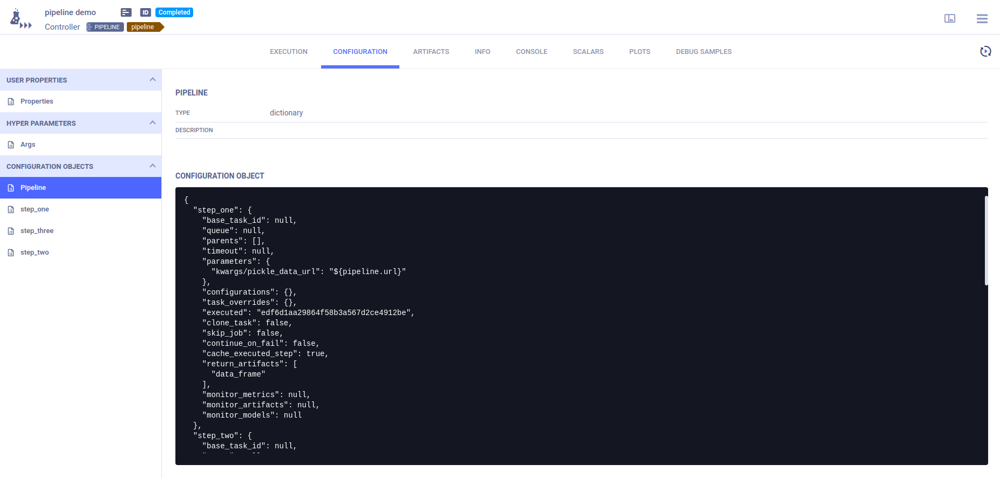
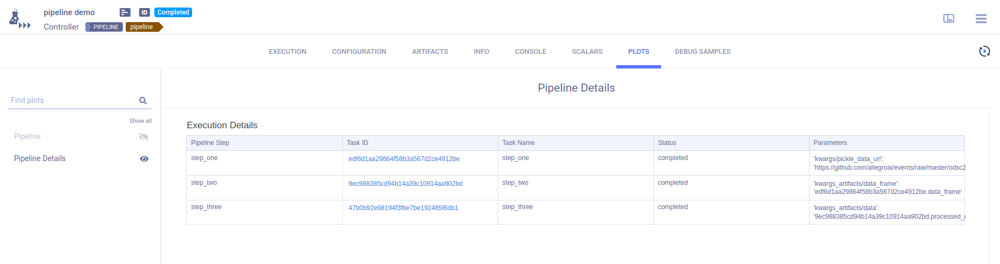
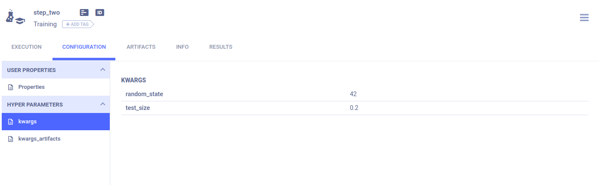

The [pipeline_from_functions.py](https://github.com/allegroai/clearml/blob/master/examples/pipeline/pipeline_from_functions.py)
example script demonstrates the creation of a pipeline using the [PipelineController](../../references/sdk/automation_controller_pipelinecontroller.md) 
class.

This example creates a pipeline incorporating four tasks, each of which is created from a function:
* `executing_pipeline`- Implements the pipeline controller which defines the pipeline structure and execution logic.
* `step_one` - Downloads and processes data.
* `step_two` - Further processes the data from `step_one`.
* `step_three` - Uses the processed data from `step_two` to train a model.

The step functions will be registered as pipeline steps when they are added to the pipeline controller. The pipeline 
execution logic is defined in the pipeline controller function. 

When the pipeline steps are executed, corresponding ClearML Tasks are created. For this reason, each function which makes 
up a pipeline step needs to be self-contained. Notice that all package imports inside the function will be automatically 
logged as required packages for the pipeline execution step.


## Pipeline Controller

1. Create the [PipelineController](../../references/sdk/automation_controller_pipelinecontroller.md) object.

   ```python
   pipe = PipelineController(
        name='pipeline demo',
        project='examples',
        version='0.0.1',
        add_pipeline_tags=False,
   )
   ```
    
1. Set the default execution queue to be used. All the pipeline steps will be enqueued for execution in this queue 
   (unless overridden by the `execution_queue` parameter of  the `add_function_step` method).
    
  ```python
  pipe.set_default_execution_queue('default')
  ```
   
1. Add a pipeline level parameter that can be referenced from any step in the pipeline (see `step_one` below).
   ```python
   pipe.add_parameter(
        name='url',
        description='url to pickle file',
        default='https://github.com/allegroai/events/raw/master/odsc20-east/generic/iris_dataset.pkl'
   ) 
   ```
   
1. Build the pipeline (see [`PipelineController.add_function_step`](../../references/sdk/automation_controller_pipelinecontroller.md#add_function_step) 
   for complete reference).
   
   The first step in the pipeline uses the `step_one` function and uses as its input the pipeline level argument defined 
   above. Its return object will be stored as an artifact under the name `data_frame`.

   ```python
   pipe.add_function_step(
        name='step_one',
        function=step_one,
        function_kwargs=dict(pickle_data_url='${pipeline.url}'),
        function_return=['data_frame'],
        cache_executed_step=True,
   ) 
   ```
   
   The second step in the pipeline uses the `step_two` function and uses as its input the first step’s output.This reference 
   implicitly defines the pipeline structure, making `step_one` the parent step of `step_two`. 
   
   Its return object will be stored as an artifact under the name `processed_data`.
 
   ```python
   pipe.add_function_step(
        name='step_two',
        # parents=['step_one'],  # the pipeline will automatically detect the dependencies based on the kwargs inputs
        function=step_two,
        function_kwargs=dict(data_frame='${step_one.data_frame}'),
        function_return=['processed_data'],
        cache_executed_step=True,
   )
   ```
   
   The third step in the pipeline uses the `step_three` function and uses as its input the second step’s output. This 
   reference implicitly defines the pipeline structure, making `step_two`the parent step of `step_three`.
   
   Its return object will be stored as an artifact under the name `model`:
   
   ```python
   pipe.add_function_step(
        name='step_three',
        # parents=['step_two'],  # the pipeline will automatically detect the dependencies based on the kwargs inputs
        function=step_three,
        function_kwargs=dict(data='${step_two.processed_data}'),
        function_return=['model'],
        cache_executed_step=True,
    )
   ```
 
1. Run the pipeline. 
   ```python
   pipe.start()
   ```
   
   The pipeline will be launched remotely, through the `services` queue, unless otherwise specified.  
   
## WebApp
### Pipeline Controller
The pipeline controller’s **CONFIGURATION** page contains the pipeline structure and step definitions in its **Configuration Objects** 
section.

The **Pipeline** configuration object contains the pipeline structure and execution parameters.



An additional configuration object per pipeline step contains the step’s definitions and execution parameters.

The pipeline controller’s **RESULTS > PLOTS** page provides summary details for the pipeline execution.

The **Execution Flow** graphically summarizes the pipeline's execution. Hover over each step to view its details.


The **Execution Details** table provides the pipeline execution details in table format. 



### Pipeline Steps 
Each function step’s arguments are stored in their respective task’s **CONFIGURATION > HYPER PARAMETERS > kwargs**. 



Values that were listed in the `return_values`parameter of the `PipelineDecorator.component` decorator are stored as 
artifacts in the relevant step's task. These artifacts can be viewed in the step task’s ARTIFACTS tab. 


