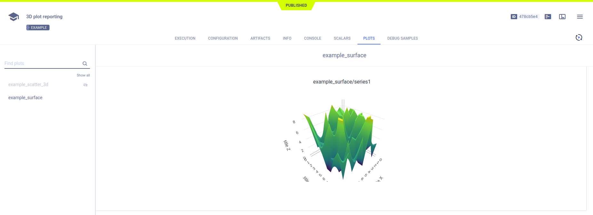

The [3d_plots_reporting.py](https://github.com/allegroai/clearml/blob/master/examples/reporting/3d_plots_reporting.py) 
example demonstrates reporting a series as a surface plot and as a 3D scatter plot. 

When the script runs, it creates an experiment named `3D plot reporting`, which is associated with the `examples` project.

**ClearML** reports these plots in the **ClearML Web UI** **>** experiment page **>** **RESULTS** tab **>** **PLOTS** sub-tab. 

## Surface Plot

To plot a series as a surface plot, use the [Logger.report_surface](../../references/sdk/logger.md#report_surface) 
method.

```python
# report 3d surface
surface = np.random.randint(10, size=(10, 10))
Logger.current_logger().report_surface(
    "example_surface",
    "series1",
    iteration=iteration,
    matrix=surface,
    xaxis="title X",
    yaxis="title Y",
    zaxis="title Z",
)
```
Visualize the reported surface plot in **RESULTS** **>** **PLOTS**.



## 3D Scatter Plot

To plot a series as a 3-dimensional scatter plot, use the [Logger.report_scatter3d](../../references/sdk/logger.md#report_scatter3d) 
method.
```python
# report 3d scatter plot
scatter3d = np.random.randint(10, size=(10, 3))
Logger.current_logger().report_scatter3d(
    "example_scatter_3d",
    "series_xyz",
    iteration=iteration,
    scatter=scatter3d,
    xaxis="title x",
    yaxis="title y",
    zaxis="title z",
)
```

Visualize the reported 3D scatter plot in **RESULTS** **>** **PLOTS**.

