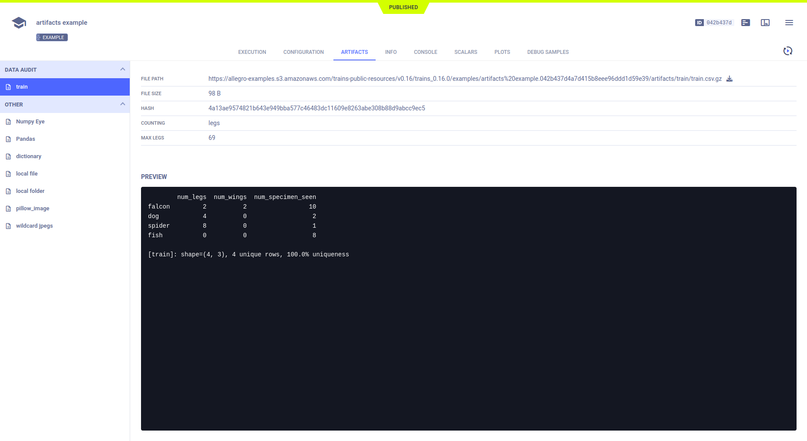

The [artifacts.py](https://github.com/allegroai/clearml/blob/master/examples/reporting/artifacts.py) example demonstrates 
uploading objects (other than models) to storage as experiment artifacts. 

These artifacts include: 
* Pandas DataFrames 
* Local files, dictionaries
* Folders
* Numpy objects
* Image files
  
Artifacts can be uploaded and dynamically tracked, or uploaded without tracking. 

Configure ClearML for uploading artifacts to any of the supported types of storage, which include local and shared folders, 
S3 buckets, Google Cloud Storage, and Azure Storage ([debug sample storage](../../references/sdk/logger.md#set_default_upload_destination) 
is different). Configure ClearML in any of the following ways:

* In the configuration file, set [default_output_uri](../../configs/clearml_conf.md#config_default_output_uri).
* In code, when [initializing a Task](../../references/sdk/task.md#taskinit), use the `output_uri` parameter.
* In the **ClearML Web UI**, when [modifying an experiment](../../webapp/webapp_exp_tuning.md#output-destination).

When the script runs, it creates an experiment named `artifacts example`, which is associated with the `examples` project. 

ClearML reports artifacts in the **ClearML Web UI** **>** experiment details **>** **ARTIFACTS** tab.



## Dynamically Tracked Artifacts

Currently, ClearML supports uploading and dynamically tracking Pandas DataFrames. Use the [Task.register_artifact](../../references/sdk/task.md#register_artifact)
method. If the Pandas DataFrame changes, ClearML uploads the changes. The updated artifact is associated with the experiment.

For example:

```python
df = pd.DataFrame(
    {
        'num_legs': [2, 4, 8, 0],
        'num_wings': [2, 0, 0, 0],
        'num_specimen_seen': [10, 2, 1, 8]
    },
    index=['falcon', 'dog', 'spider', 'fish']
)

# Register Pandas object as artifact to watch
# (it will be monitored in the background and automatically synced and uploaded)
task.register_artifact('train', df, metadata={'counting': 'legs', 'max legs': 69}))
```

By changing the artifact, and calling the [Task.get_registered_artifacts](../../references/sdk/task.md#get_registered_artifacts) 
method to retrieve it, we can see that ClearML tracked the change.

```python
# change the artifact object
df.sample(frac=0.5, replace=True, random_state=1)
# or access it from anywhere using the Task's get_registered_artifacts()
Task.current_task().get_registered_artifacts()['train'].sample(frac=0.5, replace=True, random_state=1)
```

## Artifacts Without Tracking

ClearML supports several types of objects that can be uploaded and are not tracked. Use the [Task.upload_artifact](../../references/sdk/task.md#upload_artifact) 
method. 

Artifacts without tracking include:

* Pandas DataFrames
* Local files
* Dictionaries (stored as a JSONs)
* Numpy objects (stored as NPZ files)
* Image files (stored as PNG files)
* Folders (stored as a ZIP files)
* Wildcards (stored as a ZIP files)

### Pandas DataFrames
```python
# add and upload pandas.DataFrame (onetime snapshot of the object)
task.upload_artifact('Pandas', artifact_object=df)
```

### Local Files

```python
# add and upload local file artifact
task.upload_artifact(
    'local file', 
    artifact_object=os.path.join(
        'data_samples',
        'dancing.jpg'
    )
)
```

### Dictionaries
```python
# add and upload dictionary stored as JSON
task.upload_artifact('dictionary', df.to_dict())
```
    
### Numpy Objects
```python
# add and upload Numpy Object (stored as .npz file)
task.upload_artifact('Numpy Eye', np.eye(100, 100))
```
    
### Image Files
```python
# add and upload Image (stored as .png file)
im = Image.open(os.path.join('data_samples', 'dancing.jpg'))
task.upload_artifact('pillow_image', im)
```
    
### Folders
```python
# add and upload a folder, artifact_object should be the folder path
task.upload_artifact('local folder', artifact_object=os.path.join('data_samples'))
```

### Wildcards
```python
# add and upload a wildcard
task.upload_artifact('wildcard jpegs', artifact_object=os.path.join('data_samples', '*.jpg'))
```
    