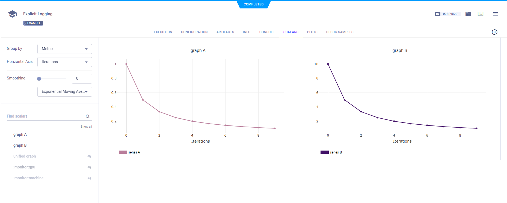
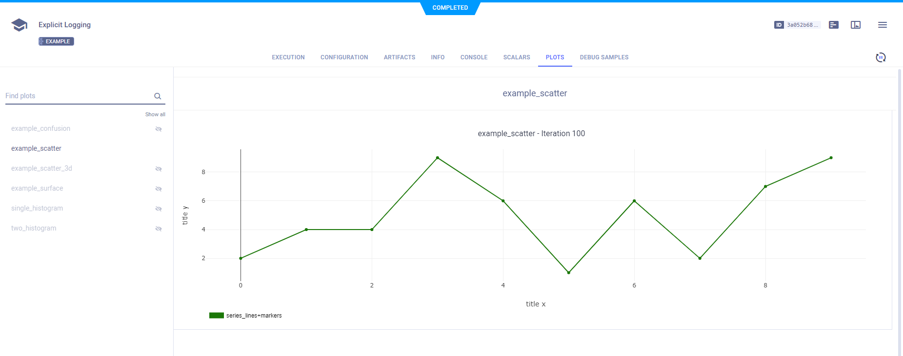
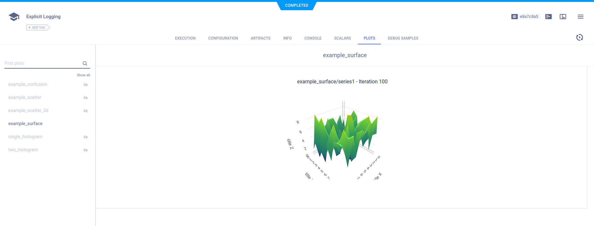
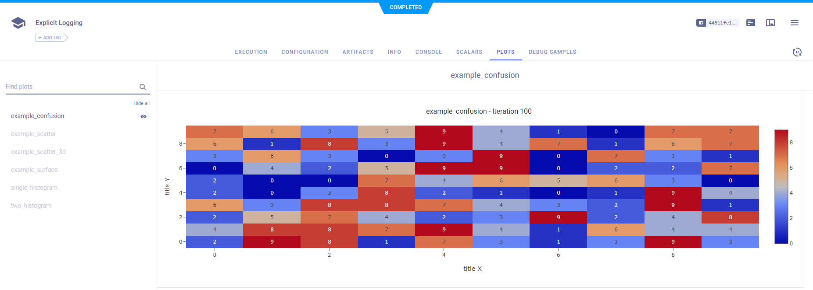
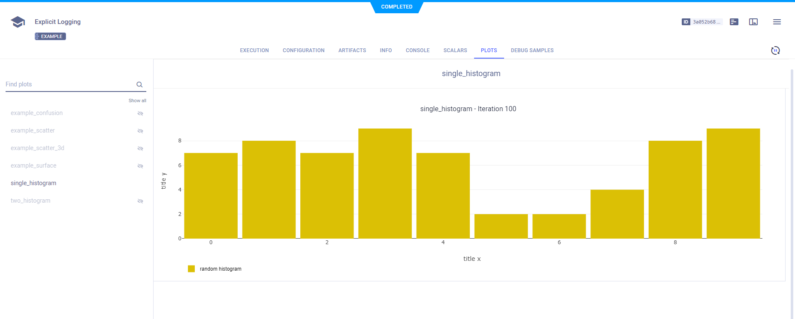
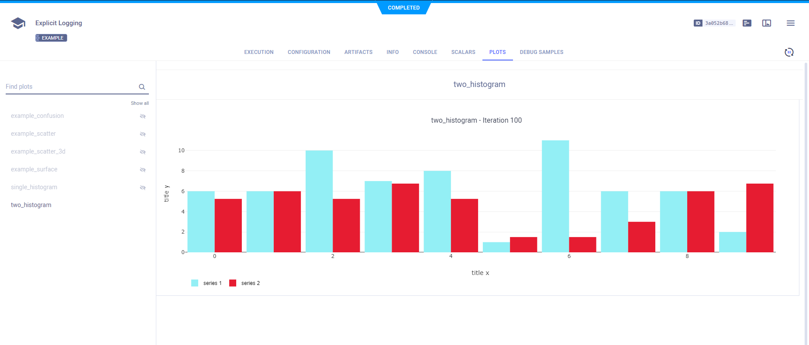
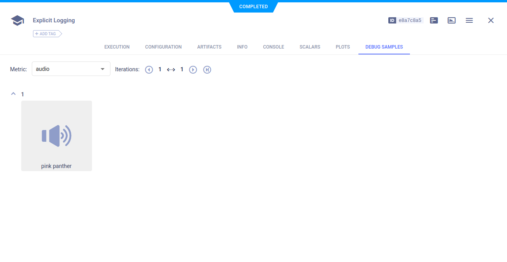
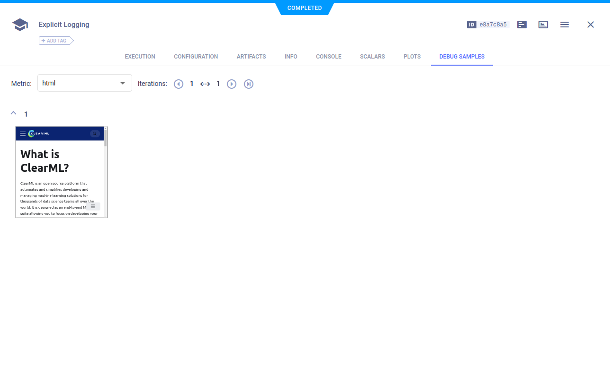
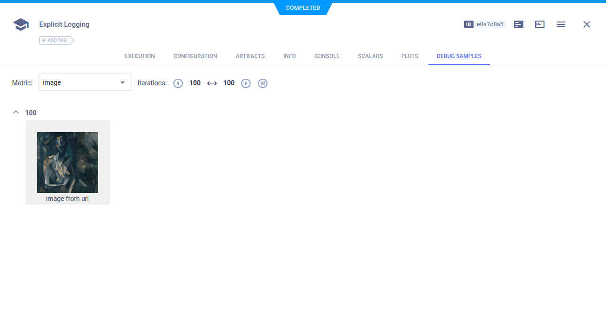
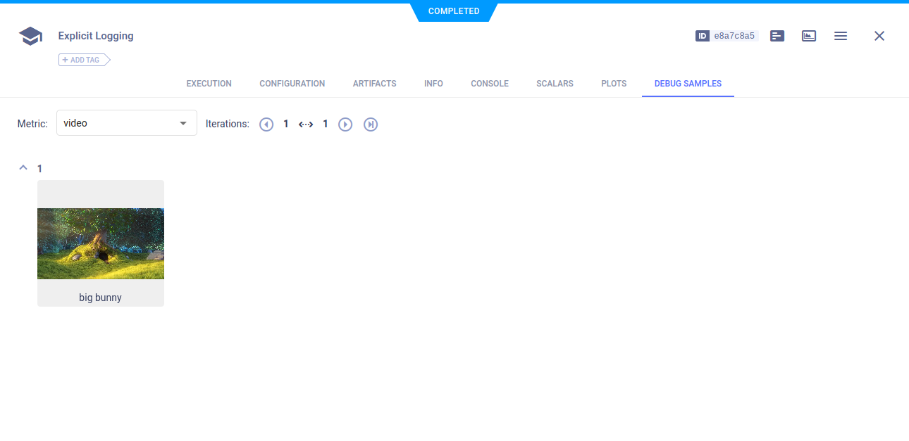

The [jupyter_logging_example.ipynb](https://github.com/allegroai/clearml/blob/master/examples/reporting/jupyter_logging_example.ipynb) 
script demonstrates the integration of ClearML's explicit reporting module, `Logger`, in a Jupyter Notebook. All ClearML 
explicit reporting works with Jupyter Notebook. 

This example includes several types of explicit reporting, including: 
* Scalars
* Some plots 
* Media.

:::note
In the ``clearml`` GitHub repository, this example includes a clickable icon to open the notebook in Google Colab.
:::

## Scalars

To reports scalars, call the [Logger.report_scalar](../../references/sdk/logger.md#report_scalar) 
method. The scalar plots appear in the **web UI** in **RESULTS** **>** **SCALARS**.

```python
# report two scalar series on two different graphs
for i in range(10):
    logger.report_scalar("graph A", "series A", iteration=i, value=1./(i+1))
    logger.report_scalar("graph B", "series B", iteration=i, value=10./(i+1))
```



```python
# report two scalar series on the same graph
for i in range(10):
    logger.report_scalar("unified graph", "series A", iteration=i, value=1./(i+1))
    logger.report_scalar("unified graph", "series B", iteration=i, value=10./(i+1))
```    


## Plots

Plots appear in **RESULTS** **>** **PLOTS**.

### 2D Plots

Report 2D scatter plots by calling the [Logger.report_scatter2d](../../references/sdk/logger.md#report_scatter2d) method. 
Use the `mode` parameter to plot data points as markers, or both lines and markers.

```python
scatter2d = np.hstack(
    (np.atleast_2d(np.arange(0, 10)).T, np.random.randint(10, size=(10, 1)))
)
# report 2d scatter plot with markers
logger.report_scatter2d(
    "example_scatter",
    "series_lines+markers",
    iteration=iteration,
    scatter=scatter2d,
    xaxis="title x",
    yaxis="title y",
    mode='lines+markers'
)
```



### 3D Plots

To plot a series as a 3-dimensional scatter plot, use the [Logger.report_scatter3d](../../references/sdk/logger.md#report_scatter3d) method.

```python
# report 3d scatter plot
scatter3d = np.random.randint(10, size=(10, 3))
logger.report_scatter3d(
    "example_scatter_3d",
    "series_xyz",
    iteration=iteration,
    scatter=scatter3d,
    xaxis="title x",
    yaxis="title y",
    zaxis="title z",
)
```


To plot a series as a surface plot, use the [Logger.report_surface](../../references/sdk/logger.md#report_surface) 
method.

```python
# report 3d surface
surface = np.random.randint(10, size=(10, 10))
logger.report_surface(
    "example_surface",
    "series1",
    iteration=iteration,
    matrix=surface,
    xaxis="title X",
    yaxis="title Y",
    zaxis="title Z",
)
```



### Confusion Matrices

Report confusion matrices by calling the [Logger.report_matrix](../../references/sdk/logger.md#report_matrix) 
method.

```python
# report confusion matrix
confusion = np.random.randint(10, size=(10, 10))
logger.report_matrix(
    "example_confusion",
    "ignored",
    iteration=iteration,
    matrix=confusion,
    xaxis="title X",
    yaxis="title Y",
)
```   



### Histograms

Report histograms by calling the [Logger.report_histogram](../../references/sdk/logger.md#report_histogram) 
method. To report more than one series on the same plot, use the same `title` argument.

```python
# report a single histogram
histogram = np.random.randint(10, size=10)
logger.report_histogram(
    "single_histogram",
    "random histogram",
    iteration=iteration,
    values=histogram,
    xaxis="title x",
    yaxis="title y",
)
```
    

    
```python
# report a two histograms on the same plot
histogram1 = np.random.randint(13, size=10)
histogram2 = histogram * 0.75
logger.report_histogram(
    "two_histogram",
    "series 1",
    iteration=iteration,
    values=histogram1,
    xaxis="title x",
    yaxis="title y",
)
logger.report_histogram(
    "two_histogram",
    "series 2",
    iteration=iteration,
    values=histogram2,
    xaxis="title x",
    yaxis="title y",
)
```



## Media

Report audio, HTML, image, and video by calling the [Logger.report_media](../../references/sdk/logger.md#report_media) 
method using the `local_path` parameter. They appear in **RESULTS** **>** **DEBUG SAMPLES**.

The media for these examples is downloaded using the [StorageManager.get_local_copy](../../references/sdk/storage.md#storagemanagerget_local_copy) 
method.

For example, to download an image:

```python
image_local_copy = StorageManager.get_local_copy(
    remote_url="https://pytorch.org/tutorials/_static/img/neural-style/picasso.jpg",
    name="picasso.jpg"
)
```

### Audio

```python
logger.report_media('audio', 'pink panther', iteration=1, local_path=audio_local_copy)
``` 



### HTML

```python
logger.report_media("html", "url_html", iteration=1, url="https://allegro.ai/docs/index.html")
```



### Images

```python
logger.report_image("image", "image from url", iteration=100, local_path=image_local_copy)
```



### Video

```python
logger.report_media('video', 'big bunny', iteration=1, local_path=video_local_copy)
```



## Text

Report text messages by calling the [Logger.report_text](../../references/sdk/logger.md#report_text). 

```python
logger.report_text("hello, this is plain text")
```    

