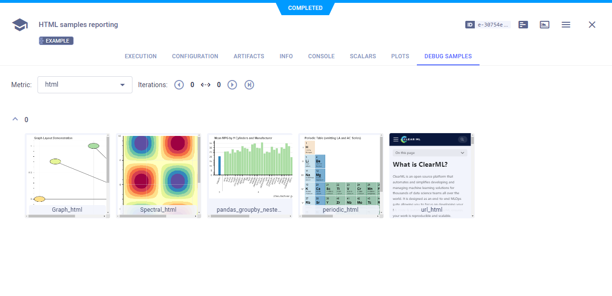

The [html_reporting.py](https://github.com/allegroai/clearml/blob/master/examples/reporting/html_reporting.py) example 
demonstrates reporting local HTML files and HTML by URL, using the [Logger.report_media](../../references/sdk/logger.md#report_media) 
method. 

**ClearML** reports these HTML debug samples in the **ClearML Web UI** **>** experiment details **>** **RESULTS** tab **>** 
**DEBUG SAMPLES** sub-tab. 

When the script runs, it creates an experiment named `html samples reporting`, which is associated with the `examples` project.



## Reporting HTML URLs

Report HTML by URL, using the [Logger.report_media](../../references/sdk/logger.md#report_media) method's `url` parameter.

See the example script's [report_html_url](https://github.com/allegroai/clearml/blob/master/examples/reporting/html_reporting.py#L16) 
function, which reports the **ClearML** documentation's home page.

```python
Logger.current_logger().report_media("html", "url_html", iteration=iteration, url="https://clear.ml/docs")
```

## Reporting HTML Local Files

Report the following using the `Logger.report_media` parameter method `local_path` parameter:
* [Interactive HTML](#interactive-html)
* [Bokeh GroupBy HTML](#bokeh-groupby-html)
* [Bokeh Graph HTML](#bokeh-graph-html)
* [Bokeh Image HTML](#bokeh-image-html)

### Interactive HTML

See the example script's [report_html_periodic_table](https://github.com/allegroai/clearml/blob/master/examples/reporting/html_reporting.py#L26) function, which reports a file created from Bokeh sample data.
```python
Logger.current_logger().report_media(
    "html", "periodic_html", iteration=iteration, local_path="periodic.html"
)
```

### Bokeh GroupBy HTML

See the example script's [report_html_groupby](https://github.com/allegroai/clearml/blob/master/examples/reporting/html_reporting.py#L117) function, which reports a Pandas GroupBy with nested HTML, created from Bokeh sample data.
```python
Logger.current_logger().report_media(
    "html",
    "pandas_groupby_nested_html",
    iteration=iteration,
    local_path="bar_pandas_groupby_nested.html",
)

```

### Bokeh Graph HTML

See the example script's [report_html_graph](https://github.com/allegroai/clearml/blob/master/examples/reporting/html_reporting.py#L162) function, which reports a Bokeh plot created from Bokeh sample data.

```python
Logger.current_logger().report_media(
    "html", "Graph_html", iteration=iteration, local_path="graph.html"
)
```

### Bokeh Image HTML

See the example script's [report_html_image](https://github.com/allegroai/clearml/blob/master/examples/reporting/html_reporting.py#L195) function, which reports an image created from Bokeh sample data.

```python
Logger.current_logger().report_media(
    "html", "Spectral_html", iteration=iteration, local_path="image.html"
)
```
