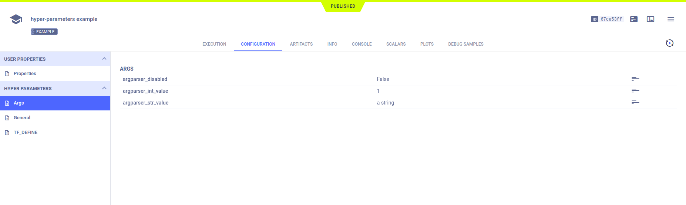
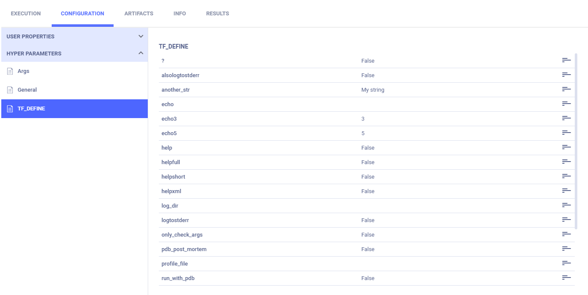
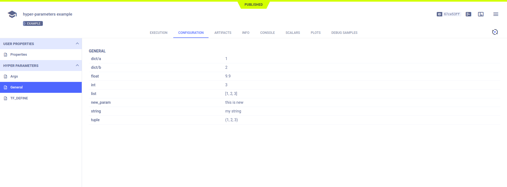

The [hyper_parameters.py](https://github.com/allegroai/clearml/blob/master/examples/reporting/hyper_parameters.py) example 
script demonstrates: 
* ClearML's automatic logging of `argparse` command line options and TensorFlow Definitions
* Logging user-defined hyperparameters with a parameter dictionary and connecting the dictionary to a Task. 

Hyperparameters appear in the **web UI** in the experiment's page, under **CONFIGURATION** **>** **HYPER PARAMETERS**. 
Each type is in its own subsection. Parameters from older experiments are grouped together with the ``argparse`` command 
line options (in the **Args** subsection).

When the script runs, it creates an experiment named `hyper-parameters example`, which is associated with the `examples` project.

## Argparse Command Line Options

If a code uses argparse and initializes a Task, ClearML automatically logs the argparse arguments.
 
```python
parser = ArgumentParser()
parser.add_argument('--argparser_int_value', help='integer value', type=int, default=1)
parser.add_argument(
    '--argparser_disabled', action='store_true', default=False, help='disables something'
)
parser.add_argument('--argparser_str_value', help='string value', default='a string')
    
args = parser.parse_args()
```

Command line options appears in **HYPER PARAMETERS** **>** **Args**.



## TensorFlow Definitions

ClearML automatically logs TensorFlow Definitions, whether they are defined before or after the Task is initialized.

```python
flags.DEFINE_string('echo', None, 'Text to echo.')
flags.DEFINE_string('another_str', 'My string', 'A string', module_name='test')

task = Task.init(project_name='examples', task_name='hyperparameters example')
    
flags.DEFINE_integer('echo3', 3, 'Text to echo.')
    
flags.DEFINE_string('echo5', '5', 'Text to echo.', module_name='test')

```    

TensorFlow Definitions appear in **HYPER PARAMETERS** **>** **TF_DEFINE**.



## Parameter Dictionaries

Connect a parameter dictionary to a Task by calling the [`Task.connect`](../../references/sdk/task.md#connect)
method, and ClearML logs the parameters. ClearML also tracks changes to the parameters.

```python
parameters = {
    'list': [1, 2, 3],
    'dict': {'a': 1, 'b': 2},
    'tuple': (1, 2, 3),
    'int': 3,
    'float': 2.2,
    'string': 'my string',
}
    
parameters = task.connect(parameters)
    
# adding new parameter after connect (will be logged as well)
parameters['new_param'] = 'this is new'
  
# changing the value of a parameter (new value will be stored instead of previous one)
parameters['float'] = '9.9'

```

Parameters from dictionaries connected to Tasks appear in **HYPER PARAMETERS** **>** **General**.



