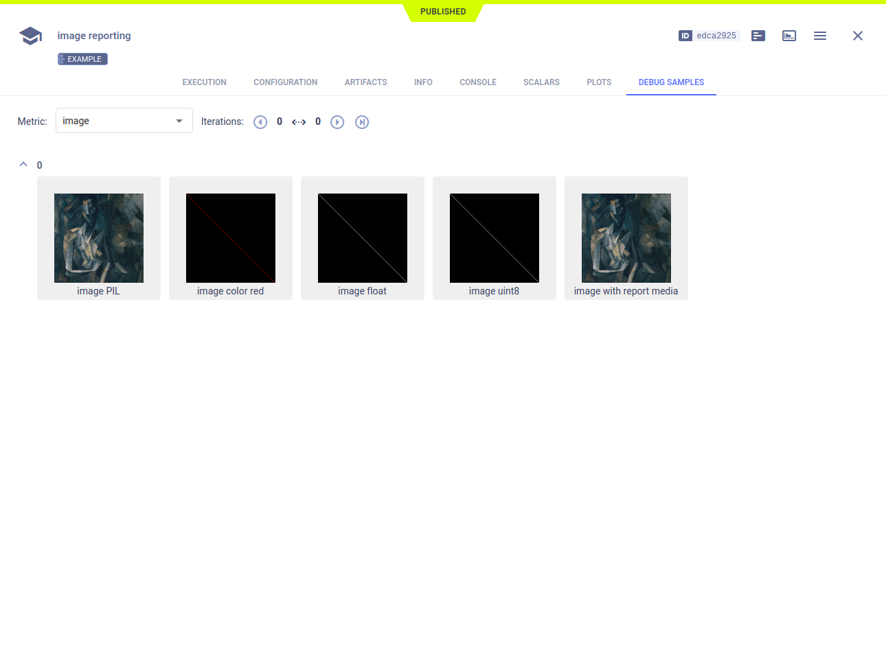

The [image_reporting.py](https://github.com/allegroai/clearml/blob/master/examples/reporting/image_reporting.py) example 
demonstrates reporting (uploading) images in several formats, including: 
* NumPy arrays
* uint8
* uint8 RGB
* PIL Image objects
* Local files. 

ClearML uploads images to the bucket specified in the ClearML [configuration file](../../configs/clearml_conf.md), 
or ClearML can be configured for image storage, see [Logger.set_default_upload_destination](../../references/sdk/logger.md#set_default_upload_destination) 
(storage for [artifacts](../../clearml_sdk/task_sdk.md#setting-upload-destination) is different). Set credentials for 
storage in the ClearML configuration file.

When the script runs, it creates an experiment named `image reporting`, which is associated with the `examples` project.

Report images using several formats by calling the [Logger.report_image](../../references/sdk/logger.md#report_image) 
method:

```python
# report image as float image
m = np.eye(256, 256, dtype=np.float)
Logger.current_logger().report_image("image", "image float", iteration=iteration, image=m)
        
# report image as uint8
m = np.eye(256, 256, dtype=np.uint8) * 255
Logger.current_logger().report_image("image", "image uint8", iteration=iteration, image=m)
        
# report image as uint8 RGB
m = np.concatenate((np.atleast_3d(m), np.zeros((256, 256, 2), dtype=np.uint8)), axis=2)
Logger.current_logger().report_image(
    "image", 
    "image color red", 
    iteration=iteration, 
    image=m
)
        
# report PIL Image object
image_open = Image.open(os.path.join("data_samples", "picasso.jpg"))
Logger.current_logger().report_image(
    "image", 
    "image PIL", 
    iteration=iteration, 
    image=image_open
)
```

ClearML reports these images as debug samples in the **ClearML Web UI**, under the experiment's
**DEBUG SAMPLES** tab. 



Double-click a thumbnail, and the image viewer opens.

