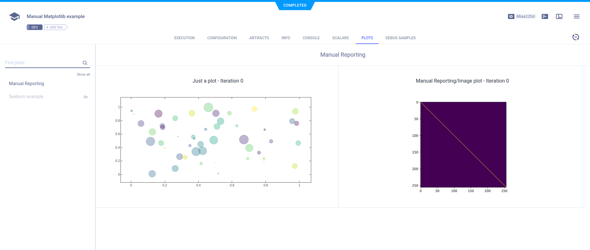

The [matplotlib_manual_reporting.py](https://github.com/allegroai/clearml/blob/master/examples/reporting/matplotlib_manual_reporting.py) 
example demonstrates reporting using Matplotlib and Seaborn with **ClearML**.

When the script runs, it creates an experiment named `Manual Matplotlib example`, which is associated with the 
`examples` project.

The Matplotlib figure reported by calling the [Logger.report_matplotlib_figure](../../references/sdk/logger.md#report_matplotlib_figure)
method appears in **RESULTS** **>** **PLOTS**.

