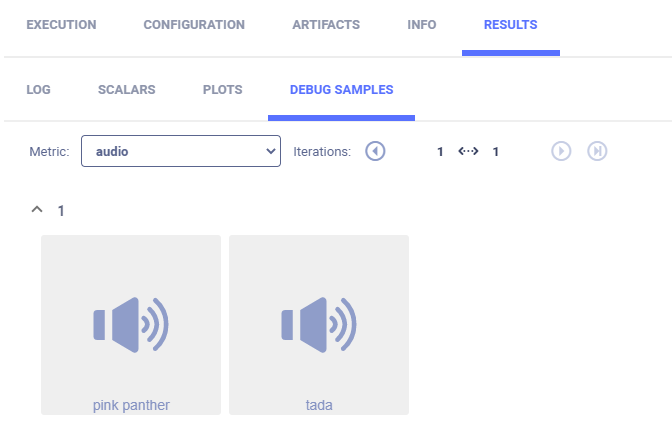
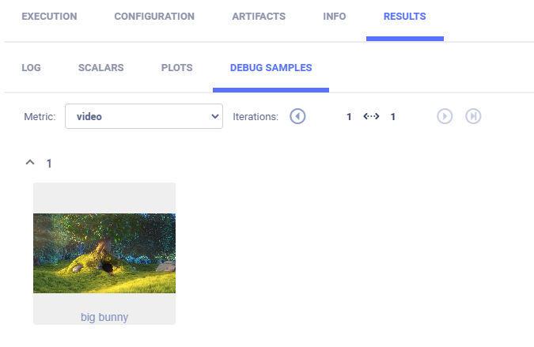

The [media_reporting.py](https://github.com/allegroai/clearml/blob/master/examples/reporting/media_reporting.py) example 
demonstrates reporting (uploading) images, audio, and video. Use the [Logger.report_media](../../references/sdk/logger.md#report_media)
method to upload from: 
* Local path
* BytesIO stream
* URL of media already uploaded to some storage

**ClearML** uploads media to the bucket specified in the **ClearML** configuration file or the Enterprise Server's [configuration vault](../../webapp/webapp_profile.md#configuration-vault), 
or **ClearML** can be configured for image storage, see [Logger.set_default_upload_destination](../../references/sdk/logger.md#set_default_upload_destination)
(storage for [artifacts](../../fundamentals/artifacts#setting-upload-destination) is different). Set credentials for storage in the **ClearML** 
[configuration file](../../configs/clearml_conf.md) (or the Enterprise Server's [configuration vault](../../webapp/webapp_profile.md#configuration-vault)).

**ClearML** reports media in the **ClearML Web UI** **>** experiment details **>** **RESULTS** tab **>** **DEBUG SAMPLES** 
sub-tab. 

When the script runs, it creates an experiment named `audio and video reporting`, which is associated with the `examples` 
project.

## Reporting (uploading) media from a source by URL

Report by calling the [Logger.report_media](../../references/sdk/logger.md#report_media) 
method using the `url` parameter.

    # report video, an already uploaded video media (url)
    Logger.current_logger().report_media(
        'video', 'big bunny', iteration=1,
        url='https://test-videos.co.uk/vids/bigbuckbunny/mp4/h264/720/Big_Buck_Bunny_720_10s_1MB.mp4')
    
    #  report audio, report an already uploaded audio media (url)
    Logger.current_logger().report_media(
        'audio', 'pink panther', iteration=1,
        url='https://www2.cs.uic.edu/~i101/SoundFiles/PinkPanther30.wav')

The reported audio can be viewed in the **DEBUG SAMPLES** sub-tab. Double click a thumbnail, and the audio player opens.

## Reporting (uploading) media from a local file

Use the `local_path` parameter.

    #  report audio, report local media audio file
    Logger.current_logger().report_media(
        'audio', 'tada', iteration=1,
        local_path=os.path.join('data_samples', 'sample.mp3'))
    
The reported video can be viewed in the **DEBUG SAMPLES** sub-tab. Double click a thumbnail, and the video player opens.

