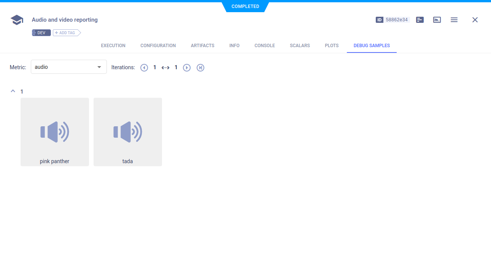

The [media_reporting.py](https://github.com/allegroai/clearml/blob/master/examples/reporting/media_reporting.py) example 
demonstrates reporting (uploading) images, audio, and video. Use [`Logger.report_media()`](../../references/sdk/logger.md#report_media)
to upload from: 
* Local path
* BytesIO stream
* URL of media already uploaded to some storage

ClearML uploads media to the bucket specified in the ClearML configuration file. You can configure ClearML for image 
storage using [`Logger.set_default_upload_destination()`](../../references/sdk/logger.md#set_default_upload_destination) 
(note that [artifact storage](../../clearml_sdk/task_sdk.md#setting-upload-destination) is handled differently). 
Set the storage credentials in the [clearml.conf file](../../configs/clearml_conf.md#sdk-section).

ClearML reports media in the **ClearML Web UI** **>** experiment details **>** **DEBUG SAMPLES** 
tab. 

When the script runs, it creates an experiment named `audio and video reporting` in the `examples` 
project.

## Reporting (Uploading) Media from a Source by URL

Report by using the `url` parameter of [`Logger.report_media()`](../../references/sdk/logger.md#report_media):

```python
# report video, an already uploaded video media (url)
Logger.current_logger().report_media(
    'video', 'big bunny', iteration=1,
    url='https://test-videos.co.uk/vids/bigbuckbunny/mp4/h264/720/Big_Buck_Bunny_720_10s_1MB.mp4'
)
    
#  report audio, report an already uploaded audio media (url)
Logger.current_logger().report_media(
    'audio', 'pink panther', iteration=1,
    url='https://www2.cs.uic.edu/~i101/SoundFiles/PinkPanther30.wav'
)
```

The reported audio can be viewed in the **DEBUG SAMPLES** tab. Click a thumbnail to open the audio player.




## Reporting (Uploading) Media from a Local File

Report by using the `local_path` parameter of [`Logger.report_media()`](../../references/sdk/logger.md#report_media):

```python
#  report audio, report local media audio file
Logger.current_logger().report_media(
    title='audio', 
    series='tada', 
    iteration=1,
    local_path=os.path.join('data_samples', 'sample.mp3')
)
```
    
The reported video can be viewed in the **DEBUG SAMPLES** tab. Click a thumbnail to open the video player.


