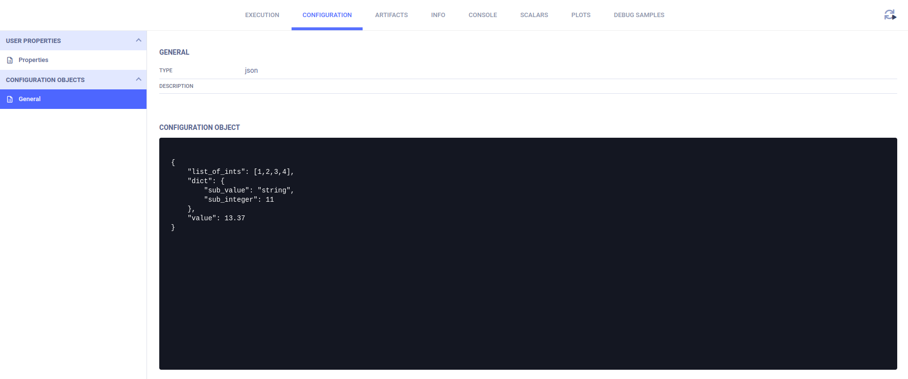
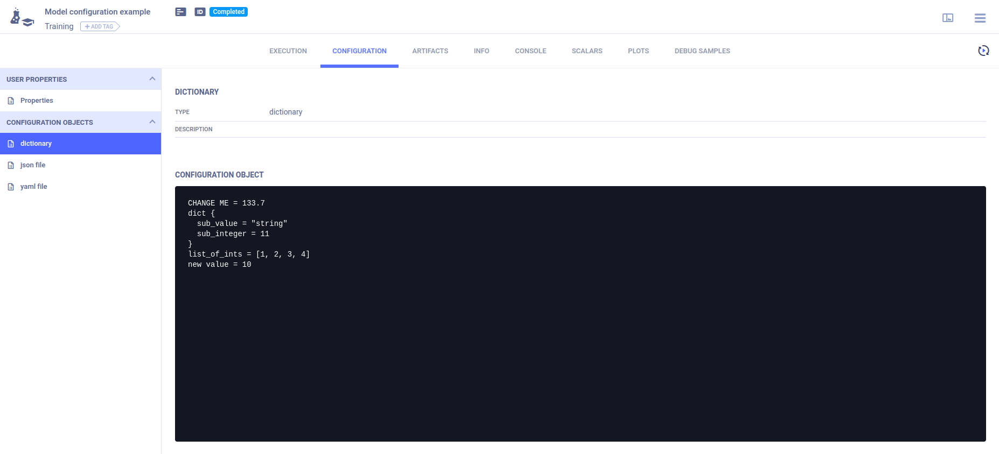
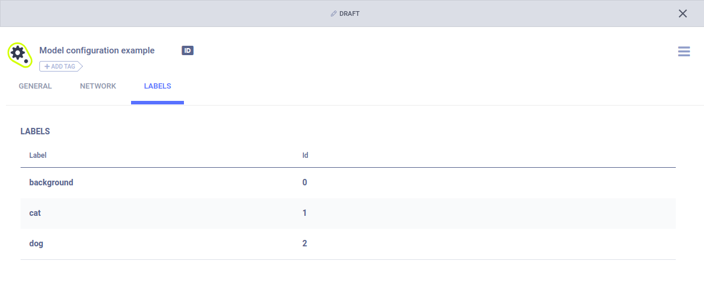

The [model_config.py](https://github.com/allegroai/clearml/blob/master/examples/reporting/model_config.py) example demonstrates 
configuring a model and defining label enumeration. Connect the configuration and label enumeration to a Task and, once 
connected, **ClearML** tracks any changes to them. When **ClearML** stores a model in any framework, **ClearML** stores 
the configuration and label enumeration with it. 

When the script runs, it creates an experiment named `Model configuration example`, which is associated with the `examples` project.

## Configuring Models

### Using a Configuration File

Connect a configuration file to a Task by calling the [Task.connect_configuration](../../references/sdk/task.md#connect_configuration) 
method with the file location and the configuration object's name as arguments. In this example, we connect a JSON file and a YAML file
to a Task. 

```python
config_file_json = 'data_samples/sample.json'
task.connect_configuration(name="json file", configuration=config_file_json)
config_file_yaml = 'data_samples/config_yaml.yaml'
task.connect_configuration(configuration=config_file_yaml, name="yaml file")
```

The configuration is logged to the ClearML Task and can be viewed in the **ClearML Web UI** experiment details **>** **CONFIGURATION** tab **>** **CONFIGURATION OBJECTS** 
section. The contents of the JSON file will appear in the **json file** object, and the contents of the YAML file will appear 
in the **yaml file** object, as specified in the `name` parameter of the `connect_configuration` method. 



### Configuration Dictionary

Connect a configuration dictionary to a Task by creating a dictionary, and then calling the [Task.connect_configuration](../../references/sdk/task.md#connect_configuration) 
method with the dictionary and the object name as arguments. After the configuration is connected, **ClearML** tracks changes to it.

```python
model_config_dict = {
    'CHANGE ME': 13.37,
    'dict': {'sub_value': 'string', 'sub_integer': 11},
    'list_of_ints': [1, 2, 3, 4],
}
model_config_dict = task.connect_configuration(
    name='dictionary', 
    configuration=model_config_dict
)

# Update the dictionary after connecting it, and the changes will be tracked as well.
model_config_dict['new value'] = 10
model_config_dict['CHANGE ME'] *= model_config_dict['new value']
```
The configurations are connected to the ClearML Task and can be viewed in the **ClearML Web UI** **>** experiment details **>** **CONFIGURATION** tab **>** 
**CONFIGURATION OBJECTS** area **>** **dictionary** object.



## Label Enumeration

Connect a label enumeration dictionary by creating the dictionary, and then calling the [Task.connect_label_enumeration](../../references/sdk/task.md#connect_label_enumeration) 
method with the dictionary as an argument.

```python
# store the label enumeration of the training model
labels = {'background': 0, 'cat': 1, 'dog': 2}
task.connect_label_enumeration(labels)
```

Log a local model file.
```python
OutputModel().update_weights('my_best_model.bin')
```    

The model which is stored contains the model configuration and the label enumeration. 


