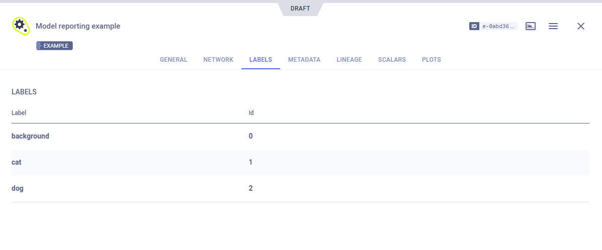

The [model_reporting.py](https://github.com/allegroai/clearml/blob/master/examples/reporting/model_reporting.py) example 
demonstrates logging a model using the [OutputModel](../../references/sdk/model_outputmodel.md) 
class. 

The example does the following:
* Creates a task named `Model reporting example` in the `examples` project.
* Uses an OutputModel object to register a previously trained model and log its label enumeration.

## Initialization
An OutputModel object is instantiated for the task. 

```python
from clearml import Task, OutputModel

# Connecting ClearML with the current process,
task = Task.init(project_name="examples", task_name="Model logging example")
 
# Create output model and connect it to the task
output_model = OutputModel(task=task)
```

## Label Enumeration

Set the model's label enumeration using [`OutputModel.update_labels()`](../../references/sdk/model_outputmodel.md#update_labels).

```python
labels = {"background": 0, "cat": 1, "dog": 2}
output_model.update_labels(labels)
```

## Registering Models
Register a previously trained model using [`OutputModel.update_weights()`](../../references/sdk/model_outputmodel.md#update_weights). 
The example code uses a model stored in S3.

```python
# Manually log a model file, which will have the labels connected above
output_model.update_weights(register_uri=model_url)
```

## WebApp
The model appears in the task's **ARTIFACTS** tab.


Clicking on the model name takes you to the [model's page](../../webapp/webapp_model_viewing.md), where you can view the 
model's details and access the model.

The model's **LABELS** tab displays its label enumeration.



## Additional Example

See [PyTorch Model Updating](../frameworks/pytorch/model_updating.md) for a more robust example, which trains a model, 
and then logs it with OutputModel.
