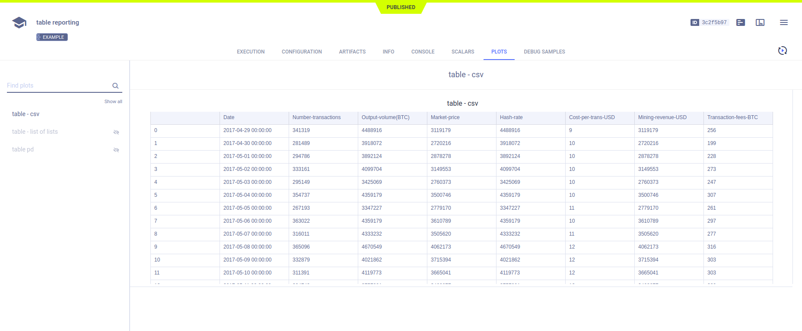

The [pandas_reporting.py](https://github.com/allegroai/clearml/blob/master/examples/reporting/pandas_reporting.py) example demonstrates reporting tabular data from Pandas DataFrames and CSV files as tables. 

ClearML reports these tables, and displays them in the **ClearML Web UI** **>** experiment details **>** **PLOTS** 
tab. 

When the script runs, it creates an experiment named `table reporting` in the `examples` project.

## Reporting Pandas DataFrames as Tables

Report Pandas DataFrames by calling [`Logger.report_table()`](../../references/sdk/logger.md#report_table), 
and providing the DataFrame in the `table_plot` parameter.

```python
# Report table - DataFrame with index
df = pd.DataFrame(
    {
        "num_legs": [2, 4, 8, 0],
        "num_wings": [2, 0, 0, 0],
        "num_specimen_seen": [10, 2, 1, 8],
    },
    index=["falcon", "dog", "spider", "fish"],
)
df.index.name = "id"
Logger.current_logger().report_table(
    title="table pd", 
    series="PD with index", 
    iteration=iteration, 
    table_plot=df
)
```


## Reporting CSV Files as Tables

Report CSV files by providing the URL location of the CSV file in the `url` parameter. For a local CSV file, use the `csv` parameter.

```python
# Report table - CSV from path
csv_url = "https://raw.githubusercontent.com/plotly/datasets/master/Mining-BTC-180.csv"
Logger.current_logger().report_table(
    title="table csv", 
    series="remote csv", 
    iteration=iteration, 
    url=csv_url
)
```

