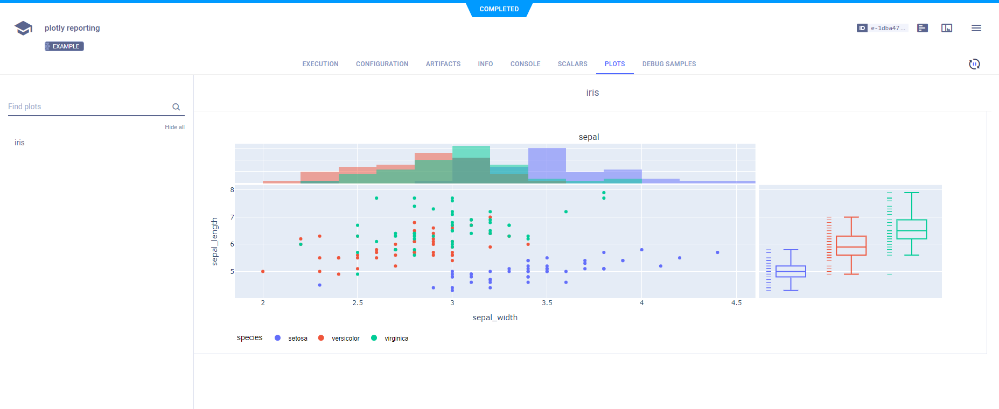

The [plotly_reporting.py](https://github.com/allegroai/clearml/blob/master/examples/reporting/plotly_reporting.py) example 
demonstrates **ClearML**'s Plotly integration and reporting. 

Report Plotly plots in **ClearML** by calling the [`Logger.report_plotly`](../../references/sdk/logger.md#report_plotly) method, and passing a complex
Plotly figure, using the `figure` parameter. 

In this example, the Plotly figure is created using `plotly.express.scatter` (see [Scatter Plots in Python](https://plotly.com/python/line-and-scatter/) 
in the Plotly documentation): 

```python
# Iris dataset
df = px.data.iris()
    
# create complex plotly figure
fig = px.scatter(
    df, 
    x="sepal_width", 
    y="sepal_length", 
    color="species", 
    marginal_y="rug", 
    marginal_x="histogram"
)
    
# report the plotly figure
task.get_logger().report_plotly(
    title="iris", series="sepal", iteration=0, figure=fig
)
```

When the script runs, it creates an experiment named `plotly reporting`, which is associated with the examples project.

**ClearML** reports Plotly plots in the **ClearML Web UI** **>** experiment details **>** **RESULTS** tab **>** **PLOTS** 
sub-tab.

