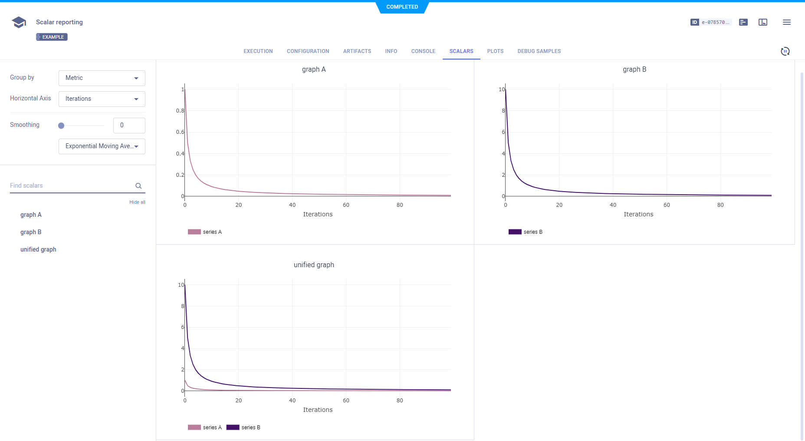

The [scalar_reporting.py](https://github.com/allegroai/clearml/blob/master/examples/reporting/scalar_reporting.py) script
demonstrates explicit scalar reporting. **ClearML** reports scalars in the **ClearML Web UI** **>** experiment details **>** 
**RESULTS** tab **>** **SCALARS** sub-tab. 

When the script runs, it creates an experiment named `scalar reporting`, which is associated with the `examples` project.

To reports scalars, call the [Logger.report_scalar](../../references/sdk/logger.md#report_scalar) 
method. To report more than one series on the same plot, use the same `title` argument. For different plots, use different 
`title` arguments. 

```python
# report two scalar series on the same graph
for i in range(100):
    Logger.current_logger().report_scalar(
        "unified graph", "series A", iteration=i, value=1./(i+1)
    )
    Logger.current_logger().report_scalar(
        "unified graph", "series B", iteration=i, value=10./(i+1)
    )
    
# report two scalar series on two different graphs
for i in range(100):
    Logger.current_logger().report_scalar(
        "graph A", "series A", iteration=i, value=1./(i+1)
    )
    Logger.current_logger().report_scalar(
        "graph B", "series B", iteration=i, value=10./(i+1)
    )
```

