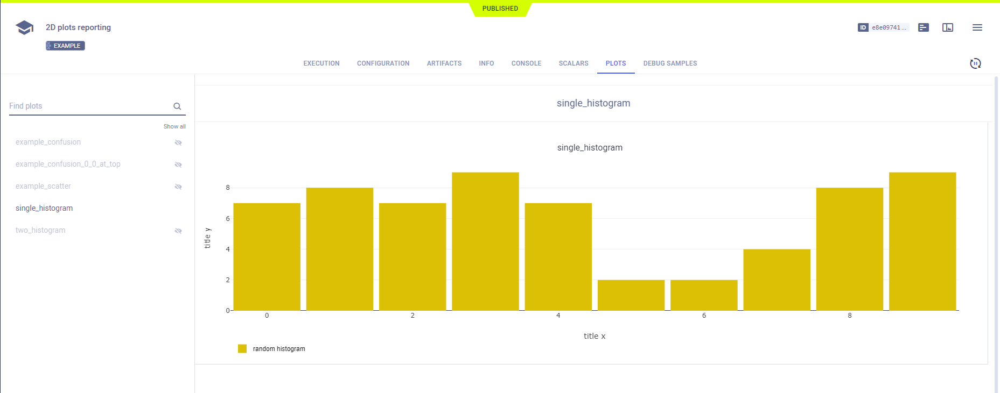
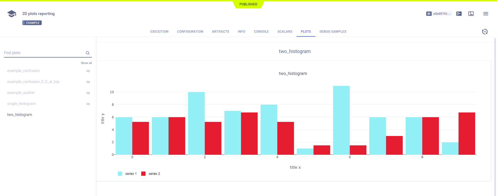
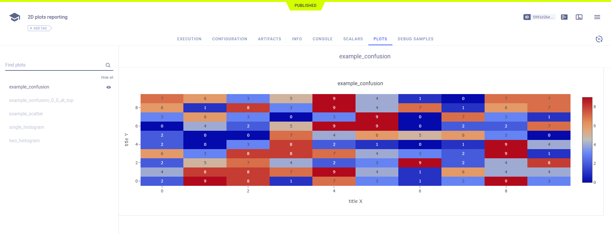

The [scatter_hist_confusion_mat_reporting.py](https://github.com/allegroai/clearml/blob/master/examples/reporting/scatter_hist_confusion_mat_reporting.py) 
example demonstrates reporting series data in the following 2D formats: 
* [Histograms](#histograms)
* [Confusion matrices](#confusion-matrices)
* [Scatter plots](#2d-scatter-plots) 

**ClearML** reports these tables in the **ClearML Web UI**, experiment details **>** **RESULTS** tab **>** **PLOTS** sub-tab. 

When the script runs, it creates an experiment named `2D plots reporting`, which is associated with the `examples` project.

## Histograms

Report histograms by calling the [Logger.report_histogram](../../references/sdk/logger.md#report_histogram) 
method. To report more than one series on the same plot, use same the `title` argument. For different plots, use different 
`title` arguments. Specify the type of histogram with the `mode` parameter. The `mode` values are `group` (the default), 
`stack`, and `relative`.

```python
# report a single histogram
histogram = np.random.randint(10, size=10)
Logger.current_logger().report_histogram(
    "single_histogram",
    "random histogram",
    iteration=iteration,
    values=histogram,
    xaxis="title x",
    yaxis="title y",
)
    
# report two histograms on the same graph (plot)
histogram1 = np.random.randint(13, size=10)
histogram2 = histogram * 0.75
Logger.current_logger().report_histogram(
    "two_histogram",
    "series 1",
    iteration=iteration,
    values=histogram1,
    xaxis="title x",
    yaxis="title y",
)
    
Logger.current_logger().report_histogram(
    "two_histogram",
    "series 2",
    iteration=iteration,
    values=histogram2,
    xaxis="title x",
    yaxis="title y",
)
```





## Confusion Matrices

Report confusion matrices by calling the [Logger.report_matrix](../../references/sdk/logger.md#report_matrix) 
method.

```python
# report confusion matrix
confusion = np.random.randint(10, size=(10, 10))
Logger.current_logger().report_matrix(
    "example_confusion",
    "ignored",
    iteration=iteration,
    matrix=confusion,
    xaxis="title X",
    yaxis="title Y",
)
```



```python
# report confusion matrix with 0,0 is at the top left
Logger.current_logger().report_matrix(
    "example_confusion_0_0_at_top",
    "ignored",
    iteration=iteration,
    matrix=confusion,
    xaxis="title X",
    yaxis="title Y",
    yaxis_reversed=True,
)
```

## 2D Scatter Plots

Report 2D scatter plots by calling the [Logger.report_scatter2d](../../references/sdk/logger.md#report_scatter2d) 
method. Use the `mode` parameter to plot data points with lines (by default), markers, or both lines and markers.

```python
scatter2d = np.hstack(
    (np.atleast_2d(np.arange(0, 10)).T, np.random.randint(10, size=(10, 1)))
)
    
# report 2d scatter plot with lines
Logger.current_logger().report_scatter2d(
    "example_scatter",
    "series_xy",
    iteration=iteration,
    scatter=scatter2d,
    xaxis="title x",
    yaxis="title y",
)
    
# report 2d scatter plot with markers
Logger.current_logger().report_scatter2d(
    "example_scatter",
    "series_markers",
    iteration=iteration,
    scatter=scatter2d,
    xaxis="title x",
    yaxis="title y",
    mode='markers'
)
    
# report 2d scatter plot with lines and markers
Logger.current_logger().report_scatter2d(
    "example_scatter",
    "series_lines+markers",
    iteration=iteration,
    scatter=scatter2d,
    xaxis="title x",
    yaxis="title y",
    mode='lines+markers'
)
```    

