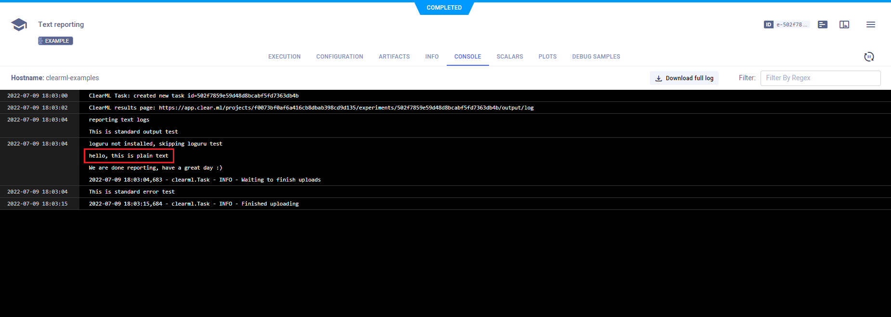

The [text_reporting.py](https://github.com/allegroai/clearml/blob/master/examples/reporting/text_reporting.py) script 
demonstrates reporting explicit text, by calling the [Logger.report_text](../../references/sdk/logger.md#report_text)
method. 

ClearML reports these tables in the **ClearML Web UI**, experiment details, **CONSOLE** tab. 

When the script runs, it creates an experiment named `text reporting` in the `examples` project.

    # report text
    Logger.current_logger().report_text("hello, this is plain text")

