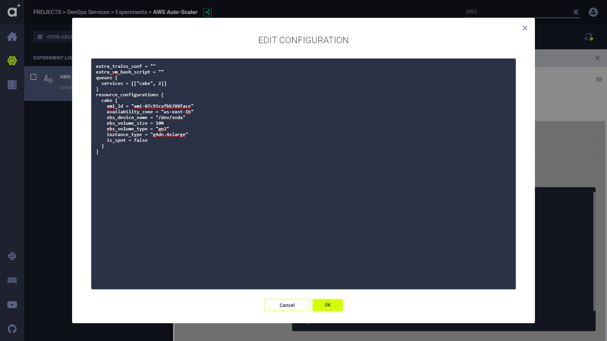
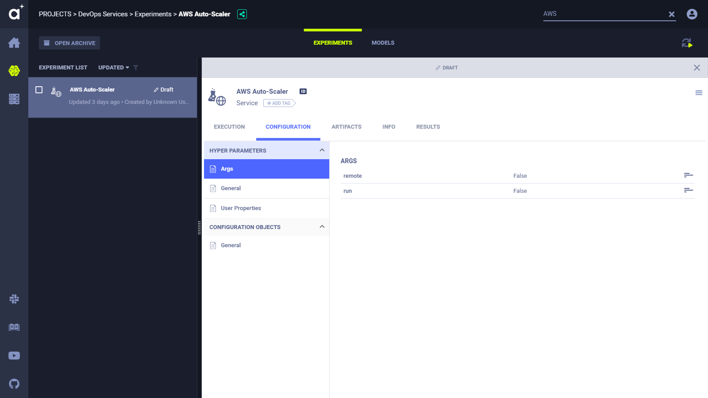

The **ClearML** AWS autoscaler optimizes AWS EC2 instance scaling according to the instance types used, and the 
budget configured. 

In the budget, set the maximum number of each instance type to spin for experiments awaiting execution in a specific queue. 
Configure multiple instance types per queue, and multiple queues. The **ClearML** AWS 
autoscaler will spin down idle instances based on the maximum idle time and the polling interval configurations. 

## Running the ClearML AWS autoscaler
The **ClearML** AWS autoscaler can execute in [ClearML services mode](../../clearml_agent.md#services-mode), 
and is configurable. 

Run **ClearML** AWS autoscaler in one of these ways:
 
* In the ClearML Web UI.
  * The autoscaler is pre-loaded in the **ClearML Server** and its status is *Draft* (editable).
  * Set the instance types and configure the budget in the **ClearML Web UI**, and then enqueue the Task to the `services` queues.
* By running the  [aws_autoscaler.py](https://github.com/allegroai/clearml/blob/master/examples/services/aws-autoscaler/aws_autoscaler.py) 
  script.
  * Run script locally or as a service.
  * When executed, a Task is created, named `AWS Auto-Scaler` that associated with the `DevOps` project.

### Running using the ClearML Web UI

Edit the parameters for the instance types, edit budget configuration by editing the Task, and then enqueue the Task to 
run in **ClearML Agent** services mode.

1. Open the **ClearML Web UI** **>** **Projects** page **>** **DevOps** project **>** **AWS Auto-Scaler** Task.
1. Set the AWS and Git credentials, parameters for idle AWS EC2 instances, and a worker prefix.
    * In the **CONFIGURATIONS** tab **>** **HYPER PARAMETERS** **>** **Args** **>** hover **>** **EDIT**. 
        * **cloud_credentials_key** - AWS access key.  
        * **cloud_credentials_region** - AWS region.
        * **cloud_credentials_secret** - AWS access secret.
        * **cloud_provider** - AWS.
        * **default_docker_image** - The default Docker image to use for the AWS EC2 instance. 
        * **git_pass** - Git password.
        * **git_user** - Git username.
        * **max_idle_time_min** - The maximum time an AWS EC2 instance can be idle before the **ClearML** AWS autoscaler spins it down.
        * **polling_interval_time_min** - How often the **ClearML** AWS autoscaler checks for idle instances.
        * **workers_prefix**
        
1. Configure the budget.
    * In **CONFIGURATION OBJECTS** **>** **General** **>** hover **>** **EDIT**. Edit the `resource_configurations` dictionary:
        
            resource_configurations {
                <resource-name> {
                  instance_type = "<instance_type>"
                  is_spot = <boolean>
                  availability_zone = "<AWS-region>"
                  ami_id = "<AMI-ID>"
                  ebs_device_name = "<EBS-device-name>"
                  ebs_volume_size = <EBS-size-in-GB>
                  ebs_volume_type = "<EBS-vol-type>"
                }
            }
            queues {
                <queue-name> = [["<resource-name>", <max-instances-of-resource-name>]]
            }
            extra_clearml_conf = "<ClearML-config-file>"
            extra_vm_bash_script = "<bash-script>"
        
        * `<resource-name>` - The name assigned to each resource (AWS EC2 instance type). Used in the budget.
        * `queues` - The **ClearML** AWS autoscaler will optimize scaling for experiments awaiting execution in these queues.
        * `<queue-name>` - A specific queue.
        * `<max-instances-of-resource-name>` - The maximum number of instances of the specified `resource-name` to spin up.
        * `is_spot` - If `true`, then use a spot instance. If `false`, then use a reserved instance.
        * `extra_clearml_conf` - A **ClearML** configuration file to use for executing experiments in **ClearML Agent**.
        * `extra_vm_bash_script` - A bash script to execute when creating an instance, before **ClearML Agent** executes.
      
      <br/>

      <details className="cml-expansion-panel screenshot">
      <summary className="cml-expansion-panel-summary">View a screenshot</summary>
      <div className="cml-expansion-panel-content">

      

      </div>
      </details>

   
1. Set the Task to run in **ClearML Agent** services mode.

    1. In **HYPER PARAMETERS** **>** **Args** **>** hover **>** **EDIT**.
     
    1. Change the **remote** parameter to **true**.
   
      <details className="cml-expansion-panel screenshot">
      <summary className="cml-expansion-panel-summary">View a screenshot</summary>
      <div className="cml-expansion-panel-content">

      

      </div>
      </details>

    
1. Click **SAVE**.

1. In the experiments table, right click the **AWS Auto-Scaler** Task **>** **Enqueue** **>** **services** queue **>**  **ENQUEUE**.
            
### Running using the script

The [aws_autoscaler.py](https://github.com/allegroai/clearml/blob/master/examples/services/aws-autoscaler/aws_autoscaler.py) 
script includes a wizard which prompts for instance details and budget configuration. 

The script can run in two ways:

* Configure and enqueue.
* Enqueue with an existing configuration.

#### To configure and enqueue:

Use the `run` command line option:

    python aws_autoscaler.py --run

   When the script runs, a configuration wizard prompts for all required information.

<br/>
<details className="cml-expansion-panel configuration">
<summary className="cml-expansion-panel-summary">View the configuration wizard steps</summary>
<div className="cml-expansion-panel-content">

1. The setup wizard begins. Enter the AWS credentials and AWS region name.

      ```console
      AWS Autoscaler setup wizard
      ---------------------------
      Follow the wizard to configure your AWS auto-scaler service.
      Once completed, you will be able to view and change the configuration in the clearml-server web UI.
      It means there is no need to worry about typos or mistakes :)
   
      Enter AWS Access Key ID : 
      Enter AWS Secret Access Key : 
      Enter AWS region name [us-east-1b]:
      ```
   
1. Enter Git credentials. These are required by **ClearML Agent** to set up a Task execution environment in an AWS EC2 instance.
  
      ```console
      GIT credentials:
      Enter GIT username for repository cloning (leave blank for SSH key authentication): []
      Enter password for user '&lt;username>':
      ```
   
   The wizard reports the Git credentials it will use.

      ```console
      Git repository cloning will be using user=*************** password=***********
      ```

1. Enter the default Docker image and parameters to use.
        
      ```console 
      Enter default docker image/parameters to use [nvidia/cuda:10.1-runtime-ubuntu18.04]:
      ```

1. For each AWS EC2 instance type that will be used in the budget, do the following:
   * Choose the instance type
   * Choose whether to use spot instances 
   * Select an AMI 
   * Define the Amazon EBS volume 
     
   Select as many instance types as needed.

      ```console
      Configure the machine types for the auto-scaler:
      ------------------------------------------------
      Select Amazon instance type ['g4dn.4xlarge']:
      Use spot instances? [y/N]: y
      Select availability zone ['us-east-1b']:
      Select the Amazon Machine Image id ['ami-07c95cafbb788face']:
      Enter the Amazon EBS device ['/dev/xvda']:
      Enter the Amazon EBS volume size (in GiB) [100]:
      Enter the Amazon EBS volume type ['gp2']:
      ```
    
   Name the instance type that was configured. Later in the configuration, use this name to create the budget.
   
      ```console
      Select a name for this instance type (used in the budget section) For example 'aws4gpu':
      ```
   
   The wizard prompts whether to select another instance type.
      
      ```console
      Define another instance type? [y/N]:
      ```
   
1. Before **ClearML Agent** executes, enter any bash script to run on newly created instances. 

      ```console
      Enter any pre-execution bash script to be executed on the newly created instances []:
      ```

1. Configure the AWS autoscaler budget. For each queue that will be used in the budget, select the queue and the maximum 
   number of each instance type, which the **ClearML** AWS autoscaler can spin up to execute experiments awaiting execution 
   in that queue.
 
      ```console 
      Define the machines budget:
      -----------------------------
        
      Select a queue name (for example: 'aws_4gpu_machines') : 
      Select a instance type to attach to the queue ['aws-g4dn.xlarge', 'aws-g4dn.8xlarge', 'aws-g4dn.16xlarge']:
      Enter maximum number of 'aws-g4dn.xlarge' instances to spin simultaneously (example: 3) :         
      ```
   
1. If needed, add another instance type to the same queue. The previous step repeats.

      ```console
      Do you wish to add another instance type to queue? [y/N]:         
      ```
   
1. The **ClearML** AWS autoscalar polls instances, and if instances have been idle for the maximum idle time that was specified, 
   the autoscaler spins them down.

      ```console
      Enter maximum idle time for the auto-scaler to spin down an instance (in minutes) [15]:
      Enter instances polling interval for the auto-scaler (in minutes) [5]:
      ```


The configuration is complete. **ClearML** initializes the Task `AWS Auto-Scaler`, the service begins, and the script 
prints a hyperlink to the Task's log.
        
```console
CLEARML Task: created new task id=d0ee5309a9a3471d8802f2561da60dfa
CLEARML Monitor: GPU monitoring failed getting GPU reading, switching off GPU monitoring
CLEARML results page: https://app.clearml-master.hosted.allegro.ai/projects/142a598b5d234bebb37a57d692f5689f/experiments/d0ee5309a9a3471d8802f2561da60dfa/output/log
Running AWS auto-scaler as a service
Execution log https://app.clearml-master.hosted.allegro.ai/projects/142a598b5d234bebb37a57d692f5689f/experiments/d0ee5309a9a3471d8802f2561da60dfa/output/log    
```


</div></details>
   
<br/>

#### To enqueue with an existing configuration:

Use the `remote` command line option:

    python aws_autoscaler.py --remote

   When the script runs, it allows you to create a new configuration.