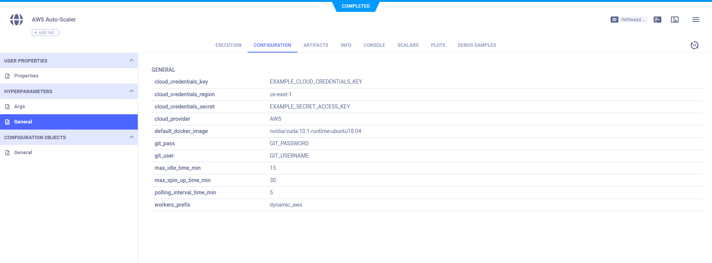

The ClearML [AWS autoscaler example](https://github.com/allegroai/clearml/blob/master/examples/services/aws-autoscaler/aws_autoscaler.py) 
demonstrates how to use the [`clearml.automation.auto_scaler`](https://github.com/allegroai/clearml/blob/master/clearml/automation/auto_scaler.py) 
module to implement a service that optimizes AWS EC2 instance scaling according to a defined instance budget.

The autoscaler periodically polls your AWS cluster and automatically stops idle instances based on a defined maximum idle time or spins 
up new instances when there aren't enough to execute pending tasks.

## Running the ClearML AWS Autoscaler

run the ClearML AWS autoscaler in one of these ways:
* Run the [aws_autoscaler.py](https://github.com/allegroai/clearml/blob/master/examples/services/aws-autoscaler/aws_autoscaler.py) 
  script locally
* Launch through your [`services` queue](../../clearml_agent.md#services-mode)

:::note Default AMI
The autoscaler services uses by default the `NVIDIA Deep Learning AMI v20.11.0-46a68101-e56b-41cd-8e32-631ac6e5d02b` AMI
:::

### Running the Script

:::info Self deployed ClearML server
A template  `AWS Auto-Scaler` task is available in the `DevOps Services` project.
You can clone it, adapt its [configuration](#configuration) to your needs, and enqueue it for execution directly from the ClearML UI. 
:::

Launch the autoscaler locally by executing the following command:

```bash
python aws_autoscaler.py --run
```

When the script runs, a configuration wizard prompts for instance details and budget configuration.

1. Enter the AWS credentials and AWS region name.

      ```console
      AWS Autoscaler setup wizard
      ---------------------------
      Follow the wizard to configure your AWS auto-scaler service.
      Once completed, you will be able to view and change the configuration in the clearml-server web UI.
      It means there is no need to worry about typos or mistakes :)
   
      Enter AWS Access Key ID : 
      Enter AWS Secret Access Key : 
      Enter AWS region name [us-east-1b]:
      ```
   
1. Enter Git credentials. These are required by ClearML Agent to set up a Task execution environment in an AWS EC2 instance.
  
      ```console
      GIT credentials:
      Enter GIT username for repository cloning (leave blank for SSH key authentication): []
      Enter password for user '&lt;username>':
      ```
   
   The wizard reports the Git credentials it will use.

      ```console
      Git repository cloning will be using user=*************** password=***********
      ```

1. Enter the default Docker image and parameters to use.
        
      ```console 
      Enter default docker image/parameters to use [nvidia/cuda:10.1-runtime-ubuntu18.04]:
      ```

1. For each AWS EC2 instance type that will be used in the budget, do the following:
   
   ```console
   Configure the machine types for the auto-scaler:
   ------------------------------------------------
   Select Amazon instance type ['g4dn.4xlarge']:
   Use spot instances? [y/N]: y
   Select availability zone ['us-east-1b']:
   Select the Amazon Machine Image id ['ami-07c95cafbb788face']:
   Enter the Amazon EBS device ['/dev/xvda']:
   Enter the Amazon EBS volume size (in GiB) [100]:
   Enter the Amazon EBS volume type ['gp2']:
   ```
   
   Name the instance type that was configured. Later in the configuration, use this name to create the budget.
   
   ```console
   Select a name for this instance type (used in the budget section) For example 'aws4gpu':
   ```
   
   The wizard prompts whether to select another instance type.
      
      ```console
      Define another instance type? [y/N]:
      ```
   
1. Enter any bash script to run on newly created instances before launching the ClearML Agent.

      ```console
      Enter any pre-execution bash script to be executed on the newly created instances []:
      ```

1. Configure the AWS autoscaler budget. For each queue that will be used in the budget, enter the maximum number of 
   instances of a selected type that can be spun up simultaneously.
 
      ```console 
      Define the machines budget:
      -----------------------------
        
      Select a queue name (for example: 'aws_4gpu_machines') : 
      Select a instance type to attach to the queue ['aws-g4dn.xlarge', 'aws-g4dn.8xlarge', 'aws-g4dn.16xlarge']:
      Enter maximum number of 'aws-g4dn.xlarge' instances to spin simultaneously (example: 3) :         
      ```
   
1. If needed, add another instance type to the same queue. The previous step repeats.

      ```console
      Do you wish to add another instance type to queue? [y/N]:         
      ```
   
1. The ClearML AWS autoscaler polls instances, and if instances have been idle for the maximum idle time that was specified, 
   the autoscaler spins them down.

      ```console
      Enter maximum idle time for the auto-scaler to spin down an instance (in minutes) [15]:
      Enter instances polling interval for the auto-scaler (in minutes) [5]:
      ```

The configuration is complete, and a new task called `AWS Auto-Scaler` is created in the `DevOps` project. The service begins, 
and the script prints a hyperlink to the Task's log.

       
```console
CLEARML Task: created new task id=d0ee5309a9a3471d8802f2561da60dfa
CLEARML Monitor: GPU monitoring failed getting GPU reading, switching off GPU monitoring
CLEARML results page: https://app.clear.ml/projects/142a598b5d234bebb37a57d692f5689f/experiments/d0ee5309a9a3471d8802f2561da60dfa/output/log
Running AWS auto-scaler as a service
Execution log https://app.clear.ml/projects/142a598b5d234bebb37a57d692f5689f/experiments/d0ee5309a9a3471d8802f2561da60dfa/output/log    
```

### Remote Execution
Using the  `--remote` command line option will enqueue the autoscaler to your [`services` queue](../../clearml_agent.md#services-mode)
once the configuration wizard is complete:

```bash
python aws_autoscaler.py --remote
```
Make sure a `clearml-agent` is assigned to that queue.

## WebApp
### Configuration 

The values configured through the wizard are stored in the task’s hyperparameters and configuration objects by using the 
[`Task.connect`](../../references/sdk/task.md#connect) and [`Task.set_configuration_object`](../../references/sdk/task.md#set_configuration_object) 
methods respectively. They can be viewed in the WebApp, in the task’s **CONFIGURATION** page under **HYPERPARAMETERS** and **CONFIGURATION OBJECTS > General**. 

ClearML automatically logs command line arguments defined with argparse. View them in the experiments **CONFIGURATION** 
page under **HYPERPARAMETERS > General**.



The task can be reused to launch another autoscaler instance: clone the task, then edit its parameters for the instance 
types and budget configuration, and enqueue the task for execution (you’ll typically want to use a ClearML Agent running 
in [services mode](../../clearml_agent.md#services-mode) for such service tasks).

### Console

All other console output appears in the experiment’s **CONSOLE**.

