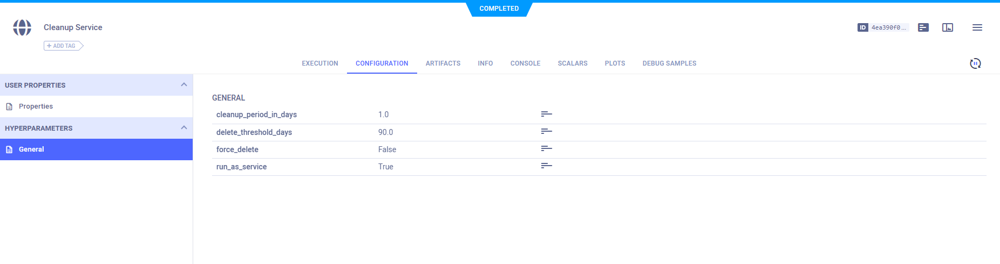
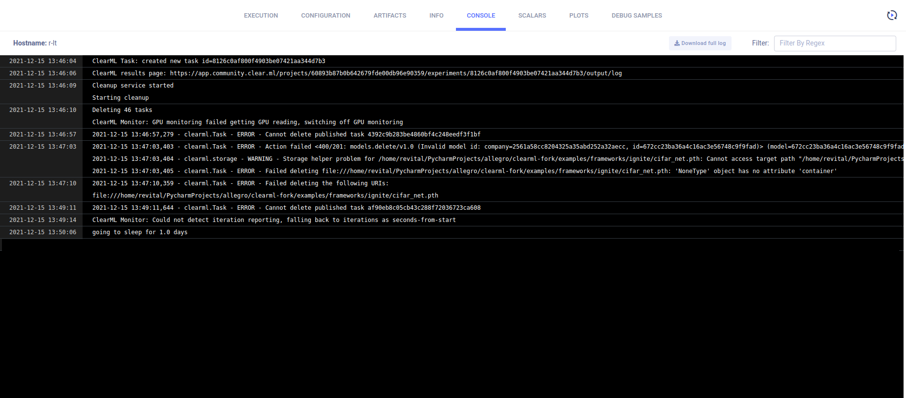

The [cleanup service](https://github.com/allegroai/clearml/blob/master/examples/services/cleanup/cleanup_service.py) 
demonstrates how to use the `clearml.backend_api.session.client.APIClient` class to implement a service that deletes old 
archived tasks and their associated files: model checkpoints, other artifacts, and debug samples. 

Modify the cleanup service’s parameters to specify which archived experiments to delete and when to delete them. 

### Running the Cleanup Service

:::info Self deployed ClearML server
A template `Cleanup Service` task is available in the `DevOps Services` project. You can clone it, adapt its [configuration](#configuration) 
to your needs, and enqueue it for execution directly from the ClearML UI. 
:::

Configure the task execution by modifying the `args` dictionary:
* `delete_threshold_days` - Tasks older than this number of days will be deleted. The default value is 30 days.
* `cleanup_period_in_days` - Repeat the cleanup service at this interval, in days. The default value is 1.0 (run once a day).
* `force_delete` - If `False` (default), delete only Draft tasks. If `True`,  allows deletion of  tasks in any status. 
* `run_as_service` - If `True` (default),  the task will be enqueued for remote execution (default queue: "services"). Otherwise, the script will execute locally. 

:::note Remote Execution
If `run_as_service` is set to `True`, make sure a `clearml-agent` is assigned to the `services` queue.
:::

Now that the script is configured, execute it: 
```bash
python cleanup_service.py
```

A new task called `Cleanup Service` is created in the `DevOps` project on your ClearML server. The script output should 
look similar to: 
```console
ClearML Task: created new task id=8126c0af800f4903be07421aa344d7b3
ClearML results page: https://app.clear.ml/projects/608e9039/experiments/81261aa34d7b3/output/log
Cleanup service started
Starting cleanup
Deleting 100 tasks
```

This is followed by details from the cleanup. 

## The Cleanup Service Code

[cleanup_service.py](https://github.com/allegroai/clearml/blob/master/examples/services/cleanup/cleanup_service.py) creates 
an `APIClient` object that establishes a session with the ClearML Server, and accomplishes the cleanup by calling:
* [`Tasks.get_all`](../../references/api/tasks.md#post-tasksget_all) to get a list of Tasks to delete, providing the following parameters:
    * `system_tags` - Get only Tasks tagged as `archived`.
    * `status_changed` - Get Tasks whose last status change is older than then delete threshold (in seconds).
* [`Task.delete`](../../references/sdk/task.md#delete) - Delete a Task.  

## Configuration
The experiment’s hyperparameters are explicitly logged to ClearML using the [`Task.connect`](../../references/sdk/task.md#connect) 
method. View them in the WebApp, in the experiment’s **CONFIGURATION** page under **HYPERPARAMETERS > General**.

The task can be reused. Clone the task, edit its parameters, and enqueue the task to run in ClearML Agent [services mode](../../clearml_agent.md#services-mode).



## Console
All console output appears in the experiment’s **CONSOLE**.


